# GitHub Issue ボット 

このワークショップでは、GitHub に issue が作成できるよう、Bot を拡張します。
HTTP Request で起動し、GitHub に issue を作成して、最後に結果を HTTP Reponse を返す 3 ステップの Logic App を作成します。
以下の Logic App のステップ図を参考にしてください。

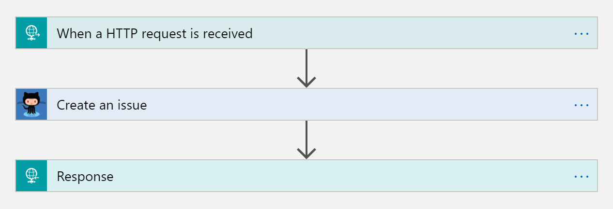

## 機能

このプロジェクトでは以下の機能を作成します。

* GitHub の issue を作成する
* 作成された issue へのリンクを HTTP Response として返す

## Getting Started

### 前提条件

1.	GitHub アカウントとレポジトリ : もしアカウントがない場合、https://github.com より作成してください。テスト用としてのみ以下のアカウントも利用可能です。  
  Username: azureserverlessdemo@gmail.com
  Password: S3rverless1

2.	Azure サブスクリプション： https://portal.azure.com で確認してください。

3. Bot Framework Emulator : https://github.com/Microsoft/BotFramework-Emulator/releases/ より取得してください。

### 手順 

#### Azure Portal にログインして、新しい Logic App を作成

1. 左側の一覧に出ていない場合は、一番したの More Services から検索が可能です。
  
    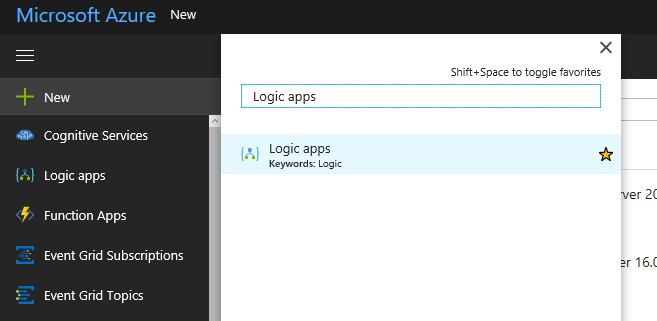
  
1. "Logic Apps" と検索バーに入力します。 
  
    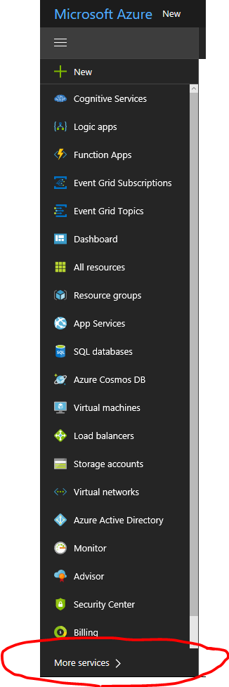
  
1. Add ボタンをクリックします。
  
    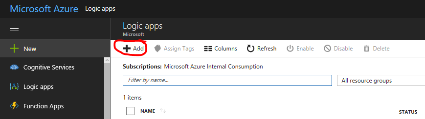
  
1. 以下のように情報を入力して、Create ボタンをクリックします。
  
    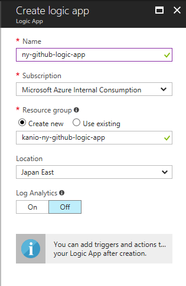
  
### Logic App を構成

1. Logic App デザイナーで “Blank Logic App” をテンプレートより選択します。

    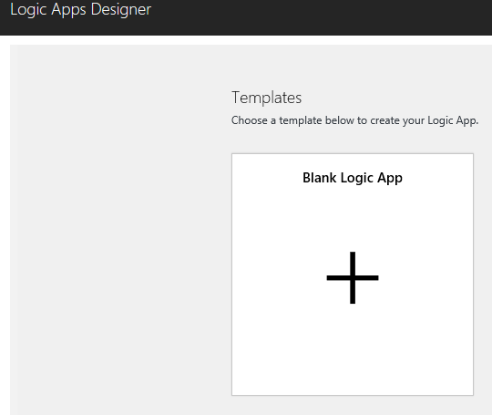

1. Connectors で ”Request” と入力して ”Request/Response" を選択します。

    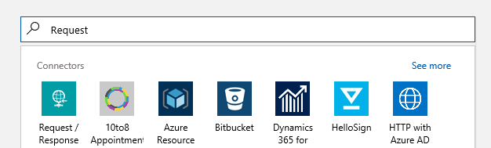
   
1. “Use sample payload to generate schema” ボタンをクリックします。

    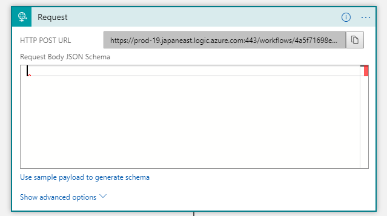
   
1. 以下の JSON をコピーして、画面にペーストします。
   
```javascript
      {
        "title": "My new issue",
        "text":  "My new issue description"
      }
```
    
    - 以下の画面と同じようにして、Done をクリックします。 
    
  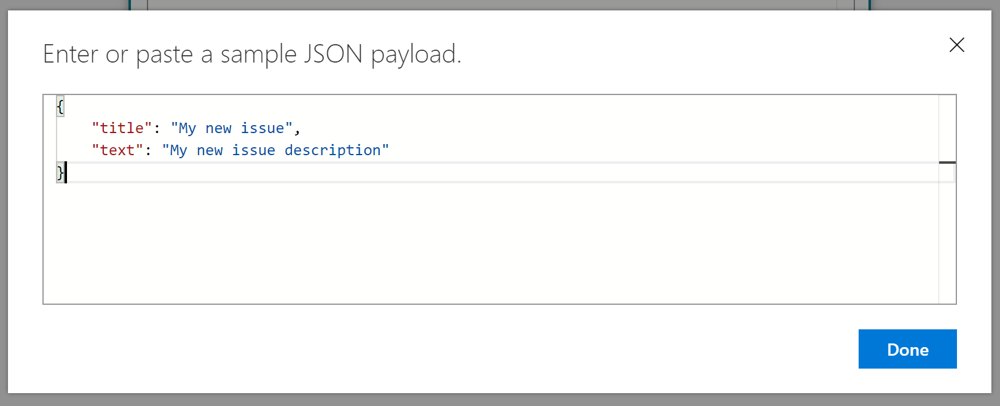
   
    - 結果が以下のようになります。 
   
  
   
    - 次に “New Step” ボタンをクリックします。”Add an action” から ”GitHub - Create an issue” を選択します。
   
  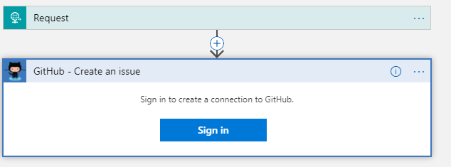
   
     - Sign In を選択して、GitHub アカウントを入力します。このアカウントで issue が作成されます。
   
  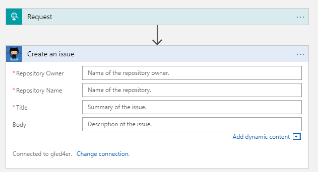
   
1. 以下図のように、title と body では dynamic content fields より、それぞれ title と text を選択します。また正しく Repository Owner と Repository Name を入力します。もしテストアカウント (azureservlessdemo@gmail.com) を使う場合、以下の情報を使ってください。自身のアカウントを使う場合には、自分のレポジトリ名を入れてください。   

      Repo Owner: azuerserverlessdemo  
      Repo Name: squirebotdemo  
      Title: Request トリガーで受け取った title を指定。  
      Text: Request トリガーで受け取った text を指定。    
     

  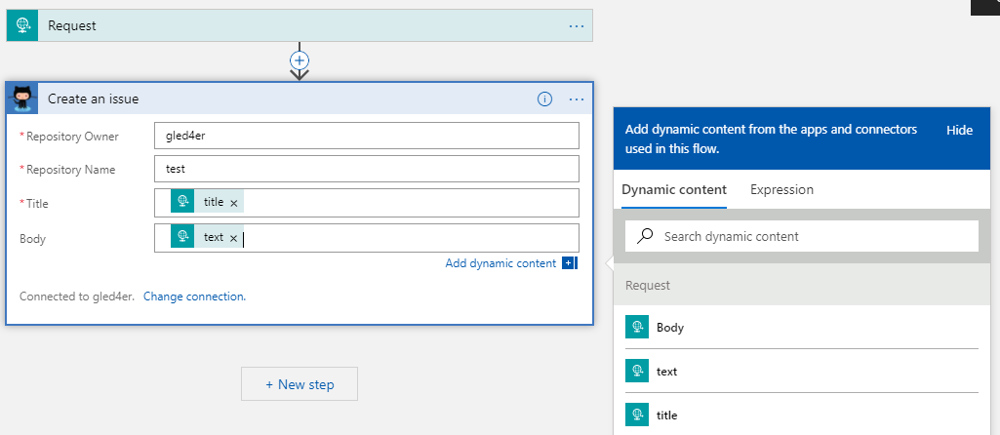

     
1. “New step” をクリックして、Response を検索、Request - Response を選択します。
     

  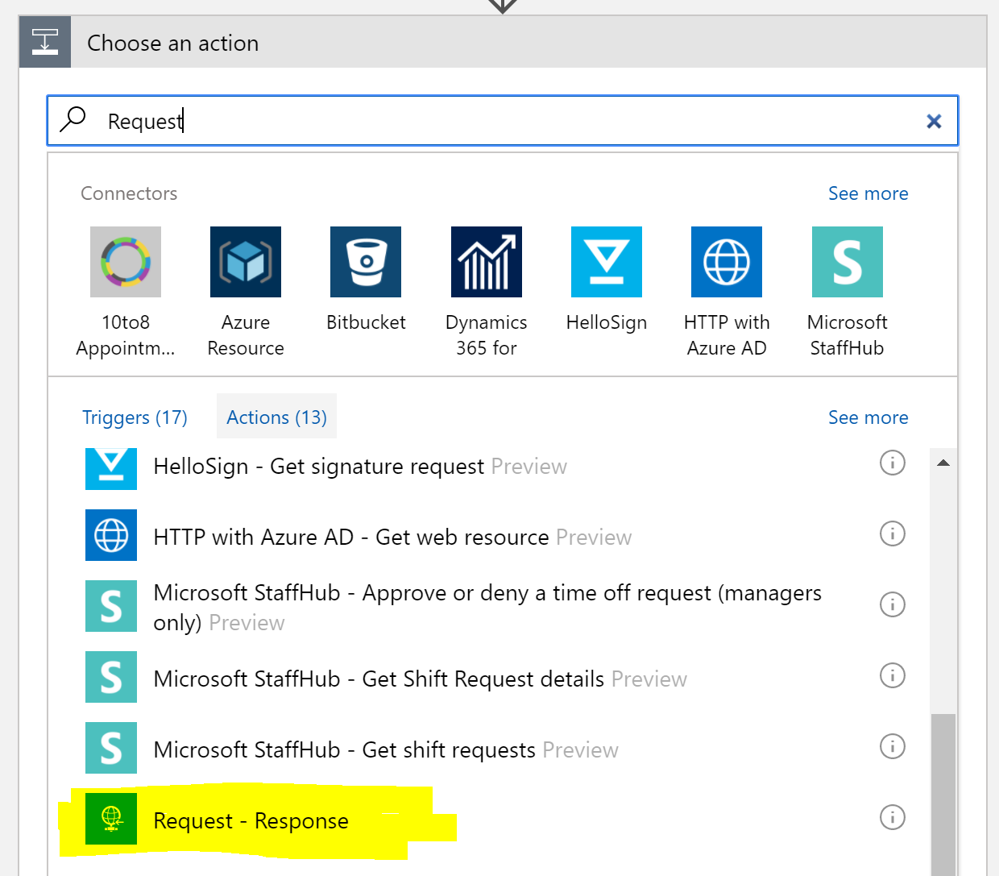

  
1. 次に Status Code に 200 指定します。Body には 以下の JSON をペーストします。input-repo-owner には GitHub のアカウントを、input-repo にはレポジトリ名を入れます。この結果が　Squire ボットでユーザーに返されます。
     
    ```javascript
    {
      "message": "[GitHub Issue Link](https://github.com/{input-repo-owner}/{input-repo}/issues/)"
    }
    ```
    
    - 最後に issues/ の後に dynamics content として GitHub の Issue ID を追加し、以下の図のようになります。:
   
  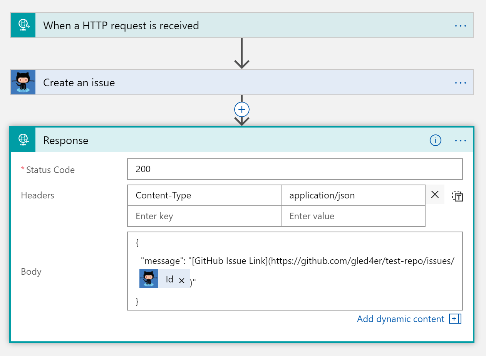
     
    - ”Save" ボタンで保存したらテストを行います。”Request" をクリックして展開し、URL をコピーします。
  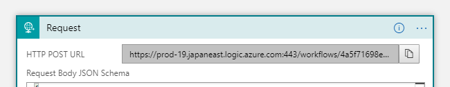
      
    - 簡単に検証するには、Postman のようなツールで POST をコピーした URL に対して実行します。Content-Type ヘッダーとして “application/json” 
  を指定してください。 
  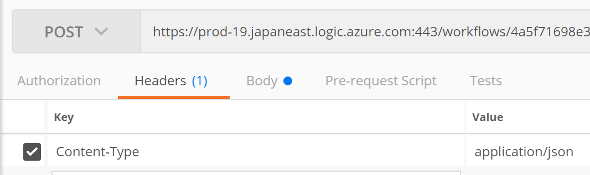
       
     - Body には上の手順で指定した JSON スキーマを使います。 
  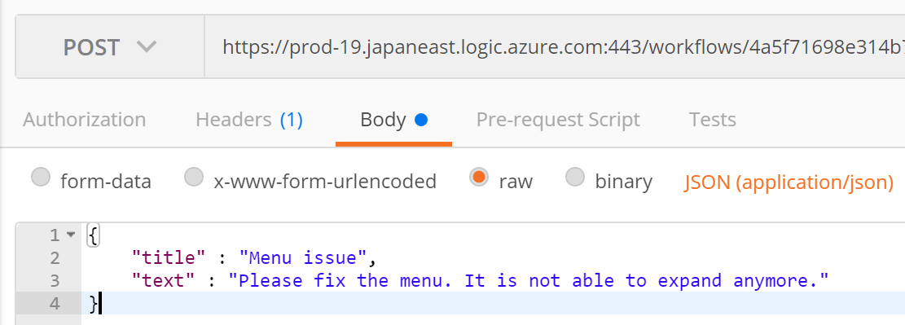
       
     - 以下のようなレスポンスが返ります。
  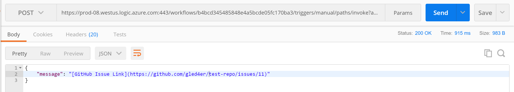
        
     - Logic App のホーム画面より実行履歴が確認でき、トラブルシューティングに役立ちます。 
  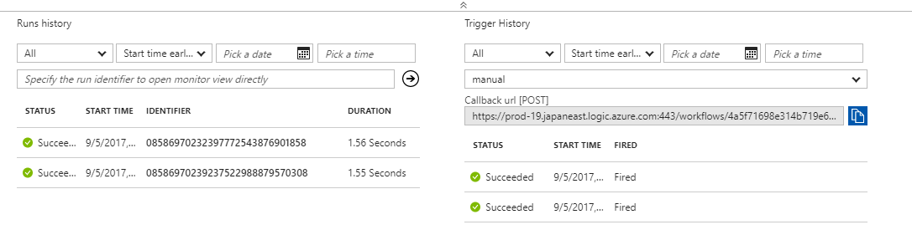
       
     - これで GitHub ボットと Squire ボットを統合できます。前回の手順を参考にして、Squire Bot をローカルで実行し、以下の図の様に Squire Bot の新しいタスクとして、 GitHub ボットを追加します。URL は Logic App の Request URL です。
  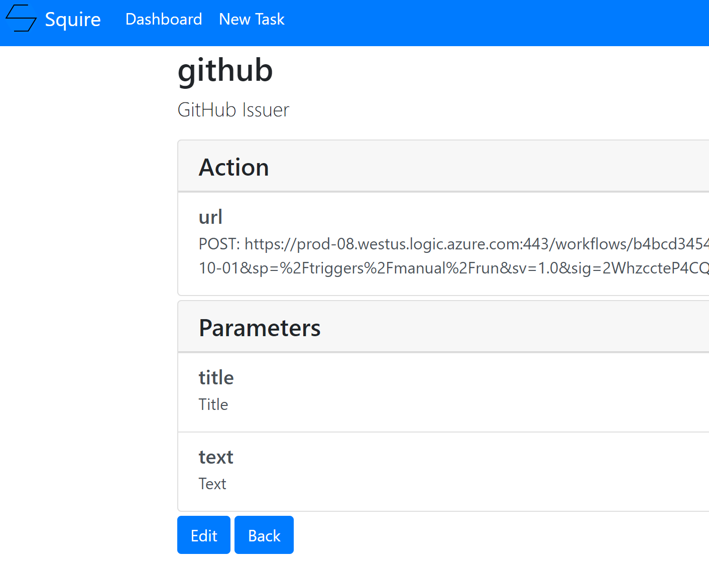
      
     - 次に Bot Framework Emulator で http://localhost:7071/api/bot に接続します。これで GitHub ボットとの連携を試すことが出来ます。”github” と話しかけて、Bot の質問に回答してください。最終的に以下の画面のように GitHub の Issue リンクが返されます。
     
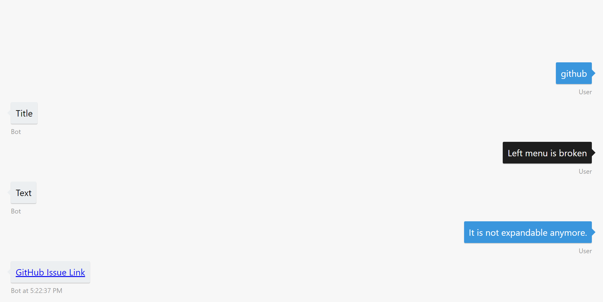
     
    
1. リンクをクリックすると、Squire ボット経由で作成した GitHub の issue ページが開きます。
     
  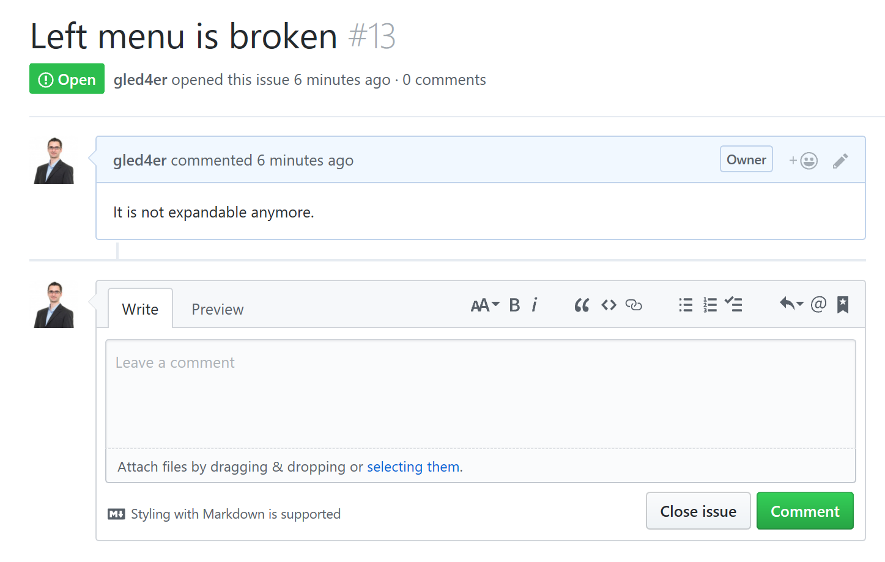
     
 おめでとうございます! これでこのモジュールは完了です！   

