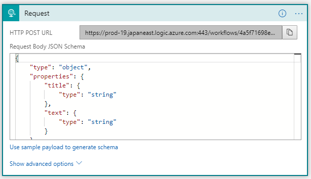
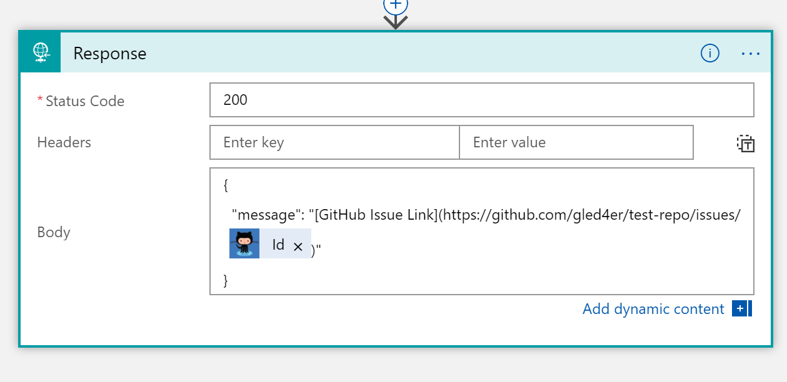

 # GitHub Issue Bot 

In this part of the workshop you will extend our bot with the capability to create an issue in GitHub. 
We will build a logic app with 3 steps. We will use Request / Response Step Connector for invoking the Logic App and providing the final response where our second step will be creating a GitHub issue.
Please refer to the diagram below showing the steps in logic app.


## Features

This project  provides the following features:

* Create GitHub Issue 
* Providing link to the created GitHub issue in the response 

## Getting Started

### Prerequisites

1.	You need to have GitHub account, if you don’t please create one here https://github.com

2.	Access to Azure Subscription, please check here https://portal.azure.com


### Walkthrough 

- Login to Azure Portal and Create new Logic App

  - If you don’t see it on your left menu you can search for it via More Services on the bottom
  
  
  
  - Then type Logic Apps in the Search Bar 
  
  
  
  - Press Add button
  
  
  
  - And fill the required data and press Create button at the bottom
  
  
  
- Next, we will configure the Logic App. In the Logic Apps Designer please select “Blank Logic App” from the Templates section
  
  
  
  - In the Connector Search select Request / Response Connector
  
   
   
   - Press “Use sample payload to generate schema” button
   
   
   
   - And paste the following JSON
   
      ```javascript
      {
        "title": "My new issue",
        "text":  "My new issue description"
      }
      ```
    
    - The contron should look like the picture below. Next press Done 
    
   
   
    - The result will look like 
   
   
   
    - Then press “New Step” button, select “Add an action” and select GitHub Connector with Action – “Create an issue”
   
    
   
     - Next, please select Sign In and input your GitHub account credentials and fill the required data that will be used for creating the GitHub issue
   
    
   
     - For title and body will pick dynamic content fields - title and text    
     
     
     
     - Press “New step” and select Response
     
     
     
     - Next we will configure the step by selecting 200 for response code, specifying the repository and its owner. It is also very important to define the body with the following json object. Squire bot will expect message propery in the body object to display the final message to the user:
     
```javascript
{
  
	"message": "[GitHub Issue Link](https://github.com/{input-repo-owner}/{input-repo}/issues/@{body('Create_an_issue')?['number']})"

}
```

   - For the issue ID in the link we construct we use dynamic value. Message content is using Markdown. 
     
   - Save your work and now you are ready to test. Go to the Request / Response connector step and copy the URL
      
      
   - If you want to your logic app immediatelly, go to Postman or similar app and POST to the provided URL. Do not forget to set Content-Type header to “application/json”
       
       
    - For the body use the JSON schema we defined several steps ago 
       
       
     - You should receive the following reponse in Postman:
        
        
     - You can go to your Logic App home screen and see the history of execution and troubleshoot 
       
       
     
 Congratulations! You competed the module! 
 
 You have just added GitHub issue creation as a new capability of our always improving bot!
 
 Thank you!
   
   

