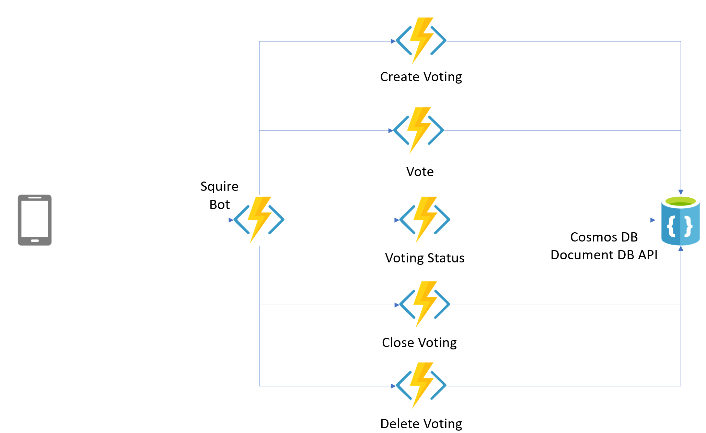
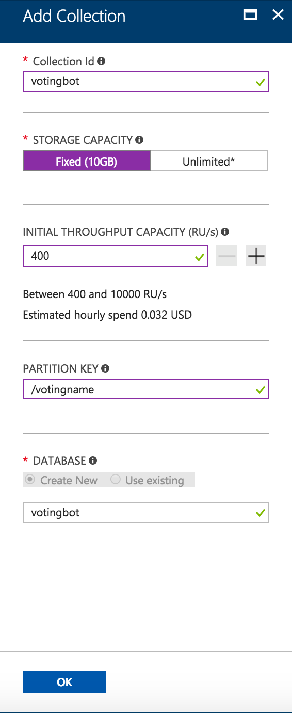
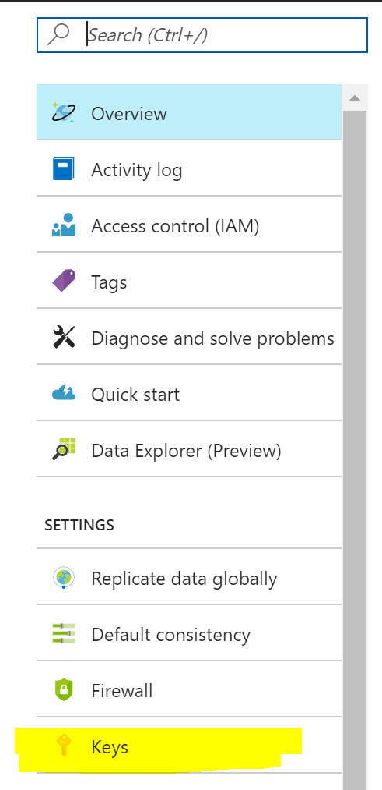
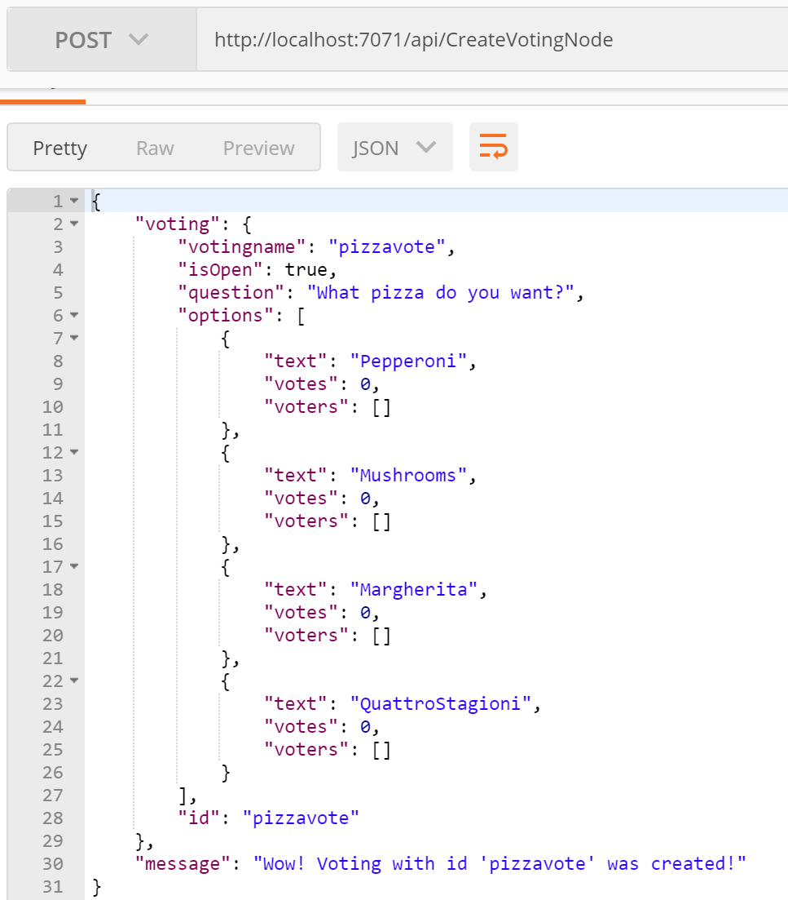
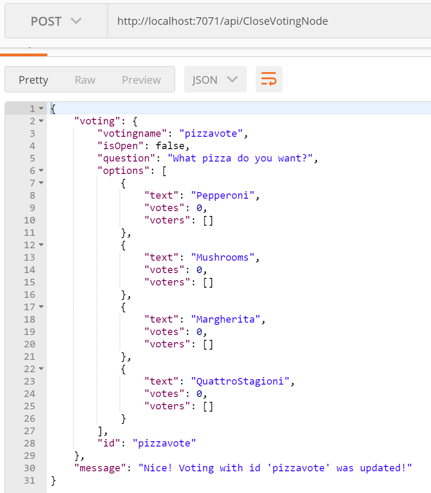
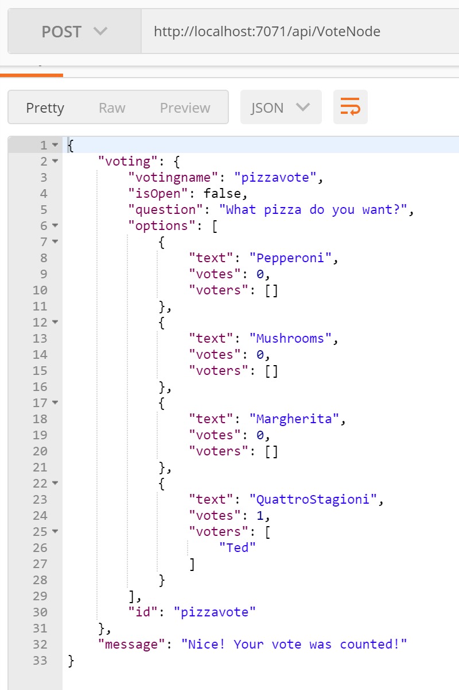
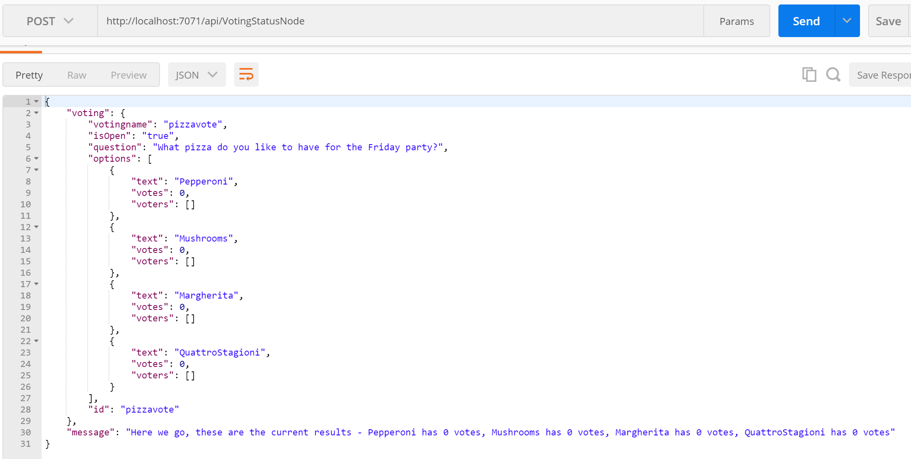
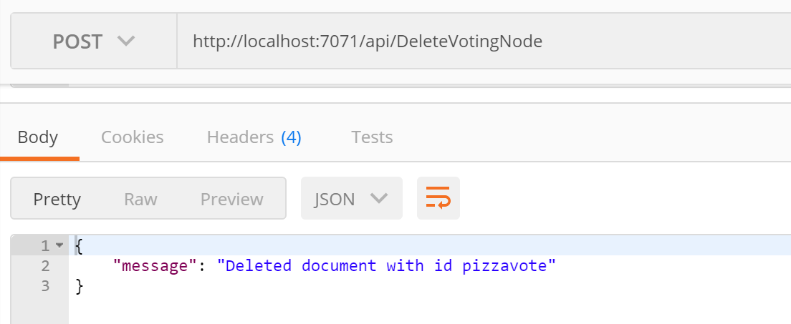
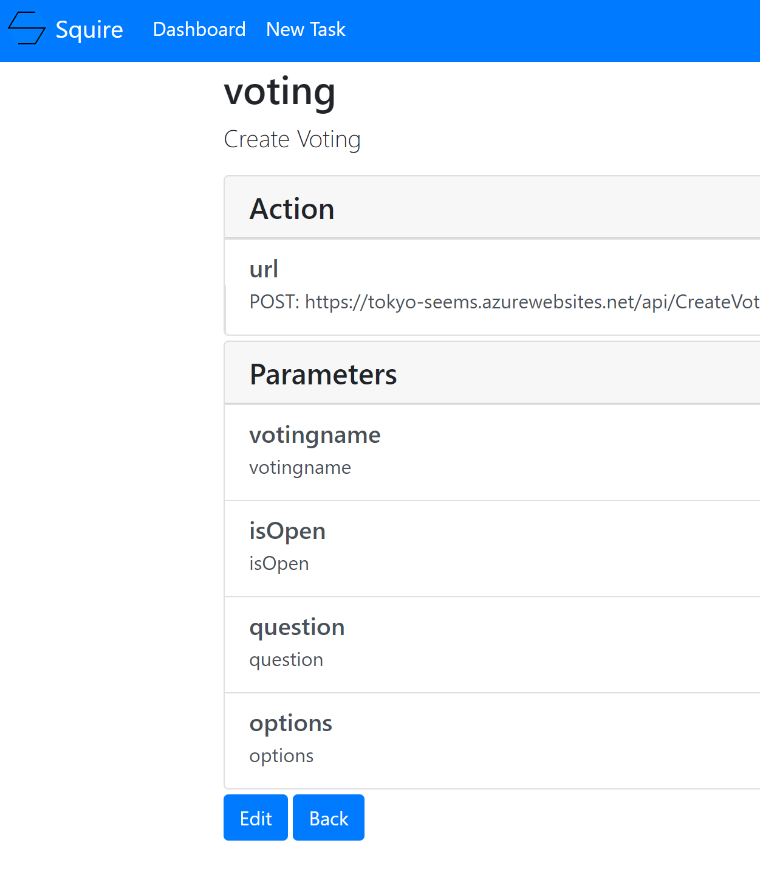
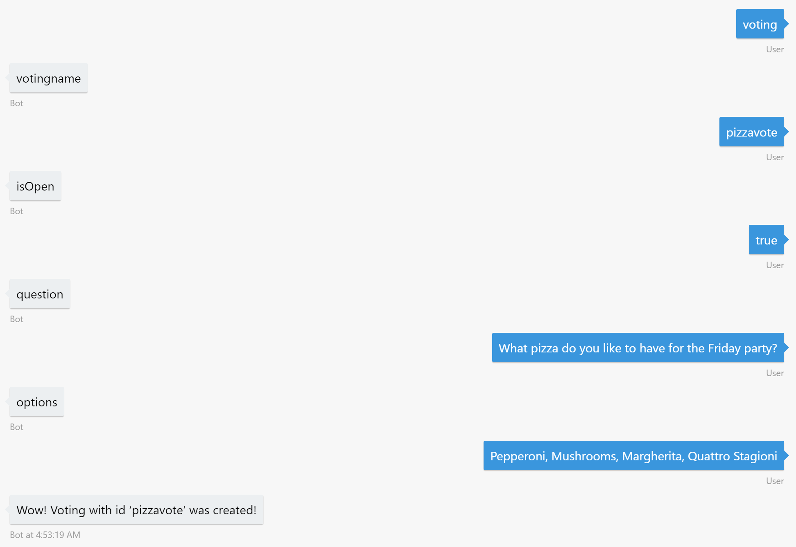

# 投票サービス

## Azure Functions のクロスプラットフォームランタイムと Node.js を使ってサーバーレスサービスを作成しよう

## 1. 概要

本パートでは、投票サービスを作ります。そして、Squire bot と連携させます。この作業のために、新しい [クロスプラットフォームの Azure Fcuntions Core Tools](https://blogs.msdn.microsoft.com/appserviceteam/2017/09/25/develop-azure-functions-on-any-platform/)を使います。これは、Azure Functions 2.0 がベースになります。




Node.js, JSON ドキュメント、CosmosDB そして、Azure Functions を使用します。

### 1.1 投票サービスの Document 

Cosmos DB に格納される 投票サービス の Document は次のようになります。投票のセッション、(voting session)、質問(question)、オプション (options) そして、投票(vote) です。下記は、JSON ドキュメントの例です。

```javascript
{
    "votingname": "pizzavote",
    "name": "Pizza Voting",
    "isOpen": true,
    "question": "What pizza do you want?",
    "options": [
        {
            "text": "Pepperoni",
            "votes": 3,
            "voters": ["Thiago", "Jeff", "Raman"]

        },
        {
            "text": "Mushrooms",
            "votes": 1,
            "voters": ["David"]
        },
        {
            "text": "Margherita",
            "votes": 3,
            "voters": ["Donna", "Kanio", "Chris"]
        },
        {
            "text": "Quattro Stagioni",
            "votes": 0
        }
    ]
}
```

### 1.3 投票サービスのオペレーション

Operations | Details
------------ | -------------
Create Voting Session | Create a new voting session
Close / Re-Open Voting| Change status of the voting moving it from active to inactive or vice versa 
Vote | Submit user's vote
Voting Status | Get the latest results from the poll
Delete Voting Session | Remove the voting session from the data store

それぞれのオペレーションは、一つの Azure Function にマップされます。それを開発していきます。Azure Functions は、様々なHTTPリクエストを受け付けますが、今回は全てのFunction で、POST を使います。それにより、Squire Bot との連携ができるようになっています。

## 2. 前提条件

次に進む前に前提条件が満たされているか確認しましょう。

- Azure アカウント。なければここから作りましょう。 https://azure.microsoft.com/en-us/free/

- 最新の Node.js とnpm https://nodejs.org/en/download/current/ (訳者注：8.x がおすすめです。)

- Visual Studio Code https://code.visualstudio.com/Download

- Azure Functions Core Tools. 次のインストラクションにしたがってインストールしましょう。 https://blogs.msdn.microsoft.com/appserviceteam/2017/09/25/develop-azure-functions-on-any-platform/

- RESTful クライアント　ローカルと、Azure の両方にリクエストが送れるもの。オススメは Postman https://www.getpostman.com/

- Bot Framework Emulator - https://github.com/Microsoft/BotFramework-Emulator/releases/

## 3. 開発

サービスを開発しましょう

### 3.1. サーバレスのデータストア - Azure Cosmos DB

最初にデータストアを準備しましょう。 - [Azure Cosmos DB](https://docs.microsoft.com/en-us/azure/cosmos-db/introduction). Cosmos DB はマイクロソフトのグローバル分散型のマルチモデルデータベースサービスです。投票サービスでは　CosmosDBの DocumentDB と呼ばれるAPI を使用します。Document DB は、リッチで、SQL のようなクエリを使うことができ、低レイテンシーで、スキーマレスのJSON データを格納できます。今回の用途にはピッタリでしょう。Azure ポータルから、データベース環境を作成してみましょう。

#### 3.1.1 Cosmos DB のデータベースと、コレクションを Portal の Azure CLI から作成する

Azure CLI をインストールしましょう。[install the Azure CLI](https://docs.microsoft.com/en-us/cli/azure/install-azure-cli?view=azure-cli-latest) もしくは、インストールしなくてもAzure ポータルからも、CLI を使用可能です。 [Cloud Shell inside the Azure Portal](https://docs.microsoft.com/en-us/azure/cloud-shell/overview).

Azure CLI もしくは、Azure ポータルのメニューの右上にある Cloud Shell ボタンをクリックして　次のファイルを実行しましょう。`databaseAccountname` を他と重複しない名前に書き換えてください。このファイルを実行すると、Cosmos DB アカウントと、コレクションが出来上がります。

> 注意： Cosmos DB アカウントは、作成するのに数分かかります。

```sh
#!/bin/bash

# Set variables for the new account, database, and collection
resourceGroupName='votingbot'
location='eastus'
databaseAccountname='<<<<Replace-with-Your-Unique-Name>>>>'
databaseName='votingbot'
collectionName='votingbot'
partitionkeypath='/votingname'

# Create a resource group
az group create \
	--name $resourceGroupName \
	--location $location

# Create a DocumentDB API Cosmos DB account
az cosmosdb create \
	--name $databaseAccountname \
	--resource-group $resourceGroupName 

# Create a database 
az cosmosdb database create \
	--name $databaseAccountname \
	--db-name $databaseName \
	--resource-group $resourceGroupName

# Create a collection
az cosmosdb collection create \
	--collection-name $collectionName \
	--partition-key-path $partitionkeypath \
	--name $databaseAccountname \
	--db-name $databaseName \
	--throughput 400 \
	--resource-group $resourceGroupName

# Get the database account connection strings
az cosmosdb list-keys \
    --name $databaseAccountname \
    --resource-group $resourceGroupName
```

このファイルを実行すると、最後に、Cosmos DB アカウントのキーが出力されます。その中で、primaryMasterKey を保存しておきましょう。後の設定で必要になります。

#### 3.1.2 オプション： Cosmos DB のデータベースとコレクションをポータルから作成する

次の方法を使えば、CLI と同じことが、Azure ポータルでも実施可能です。

1. [Azure Portal](https://portal.azure.com)にログインします。

2. 左のパネルで、New > Databases をクリックします。次に、Azure Cosmos DB の下の Create をクリックします。次の値を入力して、Cosmos DB アカウントを作成しましょう。

Field | Value
------------ | -------------
Id | <<<make up a unique name for you!>>>
API | SQL (DocumentDB) 
Subscription | Your subscription (should already be selected)
Resource Group | Create new, votingbot
Location | East US

入力例：


> 注意： Cosmos DB アカウントは、作成するのに数分かかります。

3. Cosmos DB アカウントが作成されたら、コレクションとデータベースを次のデータを入れて作成しましょう。

Field | Value
------------ | -------------
Collection Id | votingbot
Storage Capacity | Fixed (10GB) 
Initial Throughput Capacity | 400
Partition Key | /votingname
Database | Use Existing, votingbot

 パーティションキー (a partition key)は、ドキュメントの中のプロパティで、あなたのデータをサーバやパーティションの中で、分散させるのに使われます。
 


4. 次にデータベースの Connection String を取得します。左側のメニューの中の Keys セクションを探して、その中の、Azure Cosmos DB account > Connection String をクリックします。



Primary Connection String の値を保存します。あとでこの値は利用します。

これで Azure Functions CLI と、Visual Studio Code を使って投票サービスを作成する準備が整いました。

### 3.2. 投票を作成するサービス

`VotingBot` というフォルダを作りましょう。この中に functions を書いていきます。次に、Azure Functions CLI を使って、新しい Function app を作りましょう。git リポジトリを初期化し、Cosmos DB のエクステンションを追加し、最初の Function を書いていきます。ターミナルから、`VotingBot` フォルダーの中で次のコマンドを実行しましょう。


```sh

//This initializes the function app and repo
func init

//Install the CosmosDB extension for your Functions to use
func extensions install -p Microsoft.Azure.WebJobs.Extensions.CosmosDB -v 3.0.0-beta4

//This creates a new function in the function app
func new 
// next enter 2 (to choose 2. JavaScript)
// next enter 2 (to choose 2. HttpTrigger) 
// next provide CreateVotingNode as the name of the function


// Now type the following to open Visual Studio Code
code . 
```

次に、Function のコードを変更しましょう。

`VotingBot` ディレクトリの中の`local.settings.json` を更新しましょう。`votingbot_COSMOSDB` を追加します。先ほど作成した、 Cosmos DB のアカウント名と　Primary Key もしくは、Connection String を使って下記のように設定しましょう。


```javascript
{
  "IsEncrypted": false,
  "Values": {
    "AzureWebJobsStorage": "",
    "votingbot_COSMOSDB": "AccountEndpoint=https://<<<<Replace-with-Your-CosmosDB-Account-Name>>>>.documents.azure.com:443/;AccountKey=<<<<Replace-with-Your-CosmosDB-Primary-Key>>>>;"
  }
}

```

`local.settings.json` ファイルは Function App のローカル実行用の設定ファイルです。Function App に含まれる全ての function がこれを使います。

今回のfunction は、Httpコール(HttpTrigger)をトリガーします。次のページで、トリガーとバインディングについて学んで見ましょう。[learn more about Azure Functions triggers and bindings here](https://docs.microsoft.com/en-us/azure/azure-functions/functions-triggers-bindings). 

Visual Studio Code では、`CreateVotingnode`フォルダの中の `function.json`を編集します。これにより、トリガーやバインディングが設定されます。


```javascript
{
  "bindings": [
    {
      "authLevel": "function",
      "type": "httpTrigger",
      "direction": "in",
      "methods": [ "post" ],
      "name": "req"
    },
    {
      "type": "http",
      "direction": "out",
      "name": "res"
    },
    {
      "type": "cosmosDB",
      "name": "outputDocument",
      "databaseName": "votingbot",
      "collectionName": "votingbot",
      "createIfNotExists": true,
      "connectionStringSetting": "votingbot_COSMOSDB",
      "direction": "out",
      "partitionKey": "/votingname"
    }
  ],
  "disabled": false
}
```

次に、コードを投票や、そのオプションを追加する function を作成します。ここでは、documentDB のバインディングを投票セッションのJSONをデータストアに格納するために使っています。`index.js` の内容を次のように書き換えましょう。response  にある `message` のパートは後ほど　　SquireBot で使います。


```javascript

module.exports = function (context, req) {
    context.log('JavaScript HTTP trigger function processed a request.');

    if (req.body && req.body.votingname && req.body.question && req.body.options) {
        var body = req.body;
        var votingname = body.votingname.replace(/\s/g,'').toLowerCase();
        body.votingname = votingname;
        body.id = votingname;
        var optionsValues = req.body.options.replace(/\s/g,'').split(",");
        var options = [];
        for(var i=0; i< optionsValues.length; i++){
            var option = {};
            option.text = optionsValues[i];
            option.votes = 0;
            option.voters = [];
            options.push(option);
        }

        body.options = options;

        context.bindings.outputDocument = body;

        var responseBody = {};
        responseBody.voting = body;
        responseBody.message =  "Wow! Voting with id '" + votingname + "' was created!";

        context.res = {
            status: 201, 
            body:responseBody
        };
    }
    else {
        context.res = {
            status: 400,
            body: { "message" : "Please pass a voting object in the request body"}
        };
    }
    context.done();
};

```

作成した function をテストして見ましょう。ターミナルもしくは、コマンドラインから、`votingbot` フォルダに移動して、次のコマンドを入力します。

```javascript
func host start
```

Azure Functions のランタイムがどうして、CreateVotingNode サービスをローカルPC上でホストします。最後に次のようなメッセージを出力するはずです。

```sh
Http Functions:

        CreateVotingNode: http://localhost:7071/api/CreateVotingNode
``` 

テストの準備が整いました。今、Azure Functions はローカルで動いていますが、Azure 上の Cosmos DB に接続しています。この function に Postmanなどのツールから次の JSON ボディをポストします。すると　function が実行されます。

```javascript
{
    "votingname": "pizza vote",
    "isOpen": true,
    "question": "What pizza do you want?",
    "options": "Pepperoni, Mushrooms, Margherita, Quattro Stagioni"
}
``` 

次の例では、Postman を使って、ポストしています。投票セッションの idつけずにリクエストを送って見ましょう。成功すると、Azure Cosmos DB のドキュメントを、id 付きで取得できるようになっています。



ロカールでデバッグも可能です。 ローカルで、functions が動くと、Visual Sutdio Code の Debug view で、Attach to Azure Functions の横の Play ボタンを押すと、ブレイクポイントを設定したり、変数を調査したりできます。是非お試しを。


### 3.3. サーバーレス function - 投票セッションのクローズと再オープン

この function では、投票セッションを、無効化したり、有効化したりします。これには、投票セッションドキュメントの、プロパティである`isOpen` を使います。


 `VotingBot` フォルダから、次のコマンドを実行して function を作成しましょう。

```javascript
//This creates a new function in the function app
func new 
// next enter 2 (to choose 2. JavaScript)
// next enter 2 (to choose 2. HttpTrigger) 
// next provide CloseVotingNode as the name of the function

// Now type the following to open Visual Studio Code if you don't have it already open
code . 
```

function のバインディングの設定は、先ほどのサービスとは異なります。リクエストに含まれる `votingname` の値から既存のドキュメントを見つけるバインディングと、ドキュメントを更新する出力バインディングが設定されています。`CloseVotingNode` フォルダの中の `functions.json` を次のように書き換えましょう。 


```javascript
{
  "disabled": false,
  "bindings": [
    {
      "authLevel": "function",
      "type": "httpTrigger",
      "direction": "in",
      "methods": [ "post" ],
      "name": "req"
    },
    {
      "type": "http",
      "direction": "out",
      "name": "res"
    },
    {
      "type": "cosmosDB",
      "name": "inputDocument",
      "databaseName": "votingbot",
      "collectionName": "votingbot",
      "sqlQuery": "SELECT * from c where c.id = {id}",
      "connectionStringSetting": "votingbot_COSMOSDB",
      "direction": "in"
    },
    {
      "type": "cosmosDB",
      "name": "outputDocument",
      "databaseName": "votingbot",
      "collectionName": "votingbot",
      "connectionStringSetting": "votingbot_COSMOSDB",
      "direction": "out"     
    }
  ]
}
```

この function の中で、バインディングは、たくさんの作業をしてくれています。それにより私たちはロジックに集中することができます。`CloseVotingNode` フォルダの中の `index.js` を次のように書き換えましょう。

```javascript
module.exports = function (context, req) {
    context.log('JavaScript HTTP trigger function processed a request.');

     if (req.body && req.body.id && req.body.isOpen != null) {

        if (context.bindings.inputDocument && context.bindings.inputDocument.length == 1)
        {
            var voting =  context.bindings.inputDocument[0];
            context.bindings.outputDocument = voting;
            context.bindings.outputDocument.isOpen = req.body.isOpen;

            var responseBody = {
            "voting" : {
                "votingname" : voting.votingname,
                "isOpen" : voting.isOpen,
                "question" : voting.question,
                "options" : voting.options,
                "id" : voting.id
            },
            "message" : "Nice! Voting with id '" + req.body.id + "' was updated!"
        };

            context.res = {
                status: 200,
                body: responseBody
            };
            context.done(null, context.res); 
        }
        else {
            context.res = {
                status: 400,
                body: { "message" : "Record with this votingname can not be found. Please pass a votingname of an existing document in the request body"}
            }; 
                context.done(null, context.res); 
        };
    }
    else {
        res = {
            status: 400,
            body: "Please pass a votingname and isOpen value in the request body"
        };

        context.done(null, res);
    }
};
```

この function は、次のようなボディを持ったPOST リクエストを受付ます。

```javascript
{
	"id":"pizzavote",
	"isOpen":false
}
```

この function で、isOpen を true もしくは、false に設定することができます。それは投票セッションをオープンしたり、クローズするのに使われます。

function を動かして、テストして見ましょう。URL はこちらになるはずです。 http://localhost:7071/api/CloseVotingNode.


ターミナルかコマンドラインから、`VotingBot` フォルダに移動し、`func host start` コマンドを実行します。すると次のようなラインが表示されます。

```sh
Http Functions:

        CloseVotingNode: http://localhost:7071/api/CloseVotingNode

        CreateVotingNode: http://localhost:7071/api/CreateVotingNode
```
Here's an example of testing the function using Postman:



### 3.4.  サーバレス function - 投票セッションで投票する

この function は、投票を受け付けて、投票セッションをアップデートします。

コマンドプロンプトなどで `VotingBot` フォルダに移動して、次のコマンドを実行して、function を作成しましょう。

```javascript
//This creates a new function in the function app
func new 
// next enter 2 (to choose 2. JavaScript)
// next enter 2 (to choose 2. HttpTrigger) 
// next provide VoteNode as the name of the function

// Now type the following to open Visual Studio Code if you don't have it already open
code . 
```

`VoteNode` の中の `function.json` を変更しましょう。先の例と同じようにバインディングを含んでいます。

```javascript
{
  "disabled": false,
  "bindings": [
    {
      "authLevel": "function",
      "type": "httpTrigger",
      "direction": "in",
      "methods": [ "post" ],
      "name": "req"
    },
    {
      "type": "http",
      "direction": "out",
      "name": "res"
    },
    {
      "type": "cosmosDB",
      "name": "inputDocument",
      "databaseName": "votingbot",
      "collectionName": "votingbot",
      "sqlQuery": "SELECT * from c where c.id = {id}",
      "connectionStringSetting": "votingbot_COSMOSDB",
      "direction": "in"
    },
    {
      "type": "cosmosDB",
      "name": "outputDocument",
      "databaseName": "votingbot",
      "collectionName": "votingbot",
      "connectionStringSetting": "votingbot_COSMOSDB",
      "direction": "out"     
    }
  ]
}
```

投票セッションのドキュメントを更新する function を書きます。リクエストから取得した、投票データから更新します。`VoteNode` の `index.js` を次のように更新しましょう。


```javascript
module.exports = function (context, req) {
    context.log('JavaScript HTTP trigger function processed a request.');

    if (req.body && req.body.id && req.body.user && req.body.option) {
        if (context.bindings.inputDocument && context.bindings.inputDocument.length == 1)
        {
            var body = context.bindings.inputDocument[0];
            var found = false;
            var alreadyset = false;
            for (var index = 0; index < body.options.length; ++index) {
                if (body.options[index].text.toLowerCase() == req.body.option.toLowerCase()) {
                    found = true;
                    for (var index2 = 0; index2 < body.options[index].voters.length; index2++) {
                        if (body.options[index].voters[index2].toLowerCase() == req.body.user.toLowerCase()) {
                            context.res = {
                                status: 201,
                                body: { "message" : "Vote was already there, nothing updated" }
                            };
                            alreadyset = true;
                            break;
                        }
                    }
                    if (found & !alreadyset){
                        body.options[index].votes++;
                        body.options[index].voters.push(req.body.user);
                    }
                    break;
                }
            }
            if (found & !alreadyset){
                context.bindings.outputDocument = body;

                var responseBody = {
                    "voting" : {
                        "votingname" : body.votingname,
                        "isOpen" : body.isOpen,
                        "question" : body.question,
                        "options" : body.options,
                        "id" : body.id
                    },
                    "message" : "Nice! Your vote was counted!"
                };

                context.res = {
                    status: 201, 
                    body: responseBody
                };
            }
            else {
                if (!alreadyset){
                    context.res = {
                        status: 400,
                        body: { "message" : "No vote option found with value " + req.body.option + " in voting session " + req.body.id }
                    }
                }           
            }
        }
        else {
            context.res = {
                status: 400,
                body: { "message" : "Record with this id can not be found. Please pass a id of an existing document in the request body" }
            }; 
                context.done(null, context.res); 
        };
    }
    else {
        context.res = {
            status: 400,
            body: { "message" : "Please pass a vote object in the request body" }
        };
    }
    context.done();
};
```

今回の function は次のリクエストでうまく動作します。

```javascript
{
    "id": "pizzavote",
    "user": "Ted",
    "option": "QuattroStagioni"
}
```

先の function と同じように、このfunctionを動かしてテストしてみましょう。


### 3.5.  サーバレス function - 投票セッションステータス取得

投票セッションステータスを取得することで、投票セッションのスコアを見ることができます。

`VotingBot` フォルダから、次のコマンドを使って、新い function を作成します。

```javascript
//This creates a new function in the function app
func new 
// next enter 2 (to choose 2. JavaScript)
// next enter 2 (to choose 2. HttpTrigger) 
// next provide VotingStatusNode as the name of the function

// Now type the following to open Visual Studio Code if you don't have it already open
code . 
```

この function は本来 `id` をクエリーストリングに持った GET Http メソッドを受け付けるように実装することもできるでしょう。しかし、私たちは、Squire Bot と連携させるため、POST で実装しました。そのため、本 function では、リクエスト Body に id の値をもたせてください。


`VotingStatusNode` の `function.json` を次のように更新しましょう。

```javascript
{
  "disabled": false,
  "bindings": [
    {
      "authLevel": "function",
      "type": "httpTrigger",
      "direction": "in",
      "methods": [ "post" ],
      "name": "req"
    },
    {
      "type": "http",
      "direction": "out",
      "name": "res"
    },
    {
      "type": "cosmosDB",
      "name": "inputDocument",
      "databaseName": "votingbot",
      "collectionName": "votingbot",
      "sqlQuery": "SELECT * from c where c.id = {id}",
      "connectionStringSetting": "votingbot_COSMOSDB",
      "direction": "in"
    }
  ]
}
```

このバインディングは、全ての投票ドキュメントを返却します。同じように `index.js` を更新しましょう。


```javascript
module.exports = function (context, req) {
    context.log('JavaScript HTTP trigger function processed a request.');

    if (context.bindings.inputDocument && context.bindings.inputDocument.length == 1)
    {
        var voting =  context.bindings.inputDocument[0];

        var message = "Here we go, these are the current results - ";

        for(var i=0; i < voting.options.length; i++){
            var votes = voting.options[i].votes;
            message += voting.options[i].text + " has " +  votes + (votes === 1 ? " vote" : " votes");
            if(i < voting.options.length-1 ) { message += ", "}
        }

        var responseBody = {
            "voting" : {
                "votingname" : voting.votingname,
                "isOpen" : voting.isOpen,
                "question" : voting.question,
                "options" : voting.options,
                "id" : voting.id
            },
            "message" : message
        };

        context.res = {
            status : 200,
            body : responseBody
        };
        context.done(null, context.res);
    }
    else {
        context.res = {
            status : 400,
            body: { "message" : "Record with this id can not be found. Please pass an id of an existing document in the request body" }
        };
        context.done(null, context.res);
    }
};
```

function のテストのためには、前回と同様に、POST で次のボディを持ったリクエストを送りましょう。

```javascript
{
    "id": "pizzavote"
}
```

For example:


### 3.6.  サーバレス function - 投票セッションの削除

投票セッションの削除をすることで、全ての投票も削除されます。 

'VotingBot` のフォルダから、次のコマンドで、新しい function を作成します。

```javascript
//This creates a new function in the function app
func new 
// next enter 2 (to choose 2. JavaScript)
// next enter 2 (to choose 2. HttpTrigger) 
// next provide DeleteVotingNode as the name of the function

// Now type the following to open Visual Studio Code if you don't have it already open
code . 
```

`function.json` を更新しましょう。

```javascript
{
  "disabled": false,
  "bindings": [
    {
      "authLevel": "function",
      "type": "httpTrigger",
      "direction": "in",
      "name": "req"
    },
    {
      "type": "http",
      "direction": "out",
      "name": "res"
    },
    {
      "type": "cosmosDB",
      "name": "inputDocument",
      "databaseName": "votingbot",
      "collectionName": "votingbot",
      "sqlQuery": "SELECT * from c where c.id = {id}",
      "connectionStringSetting": "votingbot_COSMOSDB",
      "direction": "in"
    }
  ]
}
```

ドキュメントの削除には、CosmosDB バインディングは使えません。代わりに `documentdb` npm パッケージを使います。`DeleteVoting` フォルダの`index.js`を更新しましょう。


```javascript
var documentClient = require("documentdb").DocumentClient;
var connectionString = process.env["votingbot_COSMOSDB"];
var arr = connectionString.split(';');
var endpoint = arr[0].split('=')[1];
var primaryKey = arr[1].split('=')[1] + "==";
var collectionUrl = 'dbs/votingbot/colls/votingbot';
var client = new documentClient(endpoint, { "masterKey": primaryKey });

module.exports = function (context, req) {
    context.log('JavaScript HTTP trigger function processed a request.');

    if (req.body && req.body.id) {
        if(context.bindings.inputDocument && context.bindings.inputDocument.length == 1) {
            deleteDocument(req.body.id, context.bindings.inputDocument[0].id).then((result) => {
                console.log(`Deleted document: ${req.body.id}`);
                context.res = {
                    status : 201,
                    body: { "message" : `Deleted document: ${req.body.id}` }
                };
                context.done(null, context.res);                
            },
            (err) => {
                context.log('error: ', err);
                context.res = {
                    body: {"message" : "Error: " + JSON.stringify(err) }
                };
                context.done(null, context.res);
            });
        }
        else {
            context.res = {
                status : 400,
                body: { "message" : "Record with this id can not be found. Please pass a id of an existing document in the request body" }
            };
            context.done(null, context.res);
        }
    }
    else {
        res = {
            status: 400,
            body: {"message" : "Please pass a name on the query string or in the request body" }
        };
        context.done(null, res);
    }
};

function deleteDocument(partitionKey, id) {
    let documentUrl = `${collectionUrl}/docs/${id}`;
    console.log(`Deleting document:\n${id}\n`);

    return new Promise((resolve, reject) => {
        client.deleteDocument(documentUrl, {
            partitionKey: [partitionKey] }, (err, result) => {
            if (err) reject(err);
            else {
                resolve(result);
            }
        });
    });
};
```


`documentdb` npm パッケージを使っていますので、function を実行するときに一工夫必要です。

1. コマンドラインか、ターミナルから、`DeleteVotingNode` に移動しましょう。
```javascript
cd DeleteVotingNode
```

2. 次のコマンドで、npm パッケージをインストールします。`node_modules`が作成されてそこに、ライブラリが格納されます。プロダクションコードの開発では、`npm init` などで、`package.json` を作成し、3-squirebot で学んだ方法で、パッケージ化するのをおすすめします。

```javascript
npm install documentdb
```

これで、function は動作するようになりますので、同じようにテストしましょう。リクエスト Body にセッションid を渡します。

```javascript
{
	"id":"pizzavote"
}
```


Postman などから、実行して、テストして見ましょう。



## 4. Azure の設定

今までは、Azure Functions をローカルで実行してきましたが、それを Azure にプッシュしてみましょう。Azure Function はいくつかの方法で、Azure にデプロイ可能です。[https://docs.microsoft.com/en-us/azure/azure-functions/functions-continuous-deployment]. 

#### 4.1 Azure ポータルの Azure CLI から、Function App を作成する

Azure CLIをインストールする [install the Azure CLI](https://docs.microsoft.com/en-us/cli/azure/install-azure-cli?view=azure-cli-latest) もしくは、ポータルの Cloud Shell を使ってください。 [Cloud Shell inside the Azure Portal](https://docs.microsoft.com/en-us/azure/cloud-shell/overview).

Azure CLI か、Azure ポータルのメニューの右上にある Cloud Shell ボタンを使って、次のファイルを実行してみましょう。

下記の変数に値を設定してください。それぞれのサービス内で、重複していない名前にしてください。
それぞれ StorageAccount の名前、Function App の名前、そして、Cosmos DBのコネクションストリングです。これによって、Function App が作成されます。

* `storageAccountName`
* `functionAppName` 
* `votingBotCosmosDBConnStr`

```sh
#!/bin/bash

# Set variables 
resourceGroupName='votingbot'
location='eastus'
storageAccountName='<<<<Replace-with-Your-Unique-Name>>>>'
functionAppName='<<<<Replace-with-Your-Unique-Name>>>>'
votingBotCosmosDBConnStr='<<<<Replace-with-Your-CosmosDB-ConnStr>>>>'
databaseName='votingbot'
collectionName='votingbot'
partitionkeypath='/votingname'

# Create an azure storage account
az storage account create \
  --name $storageAccountName \
  --location $location \
  --resource-group $resourceGroupName \
  --sku Standard_LRS

# Create Function App
az functionapp create \
  --name $functionAppName \
  --storage-account $storageAccountName \
  --consumption-plan-location $location \
  --resource-group $resourceGroupName

# Configure the function the new runtime and add the cosmosDB connection string
az functionapp config appsettings set --name $functionAppName \
--resource-group $resourceGroupName \
--settings FUNCTIONS_EXTENSION_VERSION=beta votingbot_COSMOSDB=$votingBotCosmosDBConnStr
```

Function App が Azure に作成されたら、`VotingBot` フォルダに移動してください。次のコマンドを実行してください。`FunctionAppName` は先ほど指定した名前と同じものを使用してください。

```javascript
func azure functionapp publish <<FunctionAppName>>
```

Postman から再度テストをして見ましょう。ただし、URL はあなたが今デプロイした Azure 上の Azure Functions のものを使います。Azure にデプロイした Functionの URL はこちらの記事をご参照ください。[Use the Azure Portal to get the URLs of your deployed functions](https://docs.microsoft.com/en-us/azure/azure-functions/functions-create-first-azure-function#test-the-function).


## 5. Squire Bot とのインテグレーション


最後に 投票サービスを Squire Bot と連携させてみましょう。 

投票サービスの機能を Squire Bot に追加します。最初のステップは、今回作った全ての Function を、Squire Bot の Web ページから、Taskとして登録していきます。

Squire Bot の Web ページをローカルで立ち上げます。そして、ブラウザから　http://localhost:4200 にアクセスします。それぞれの Task で下記のパラメータを設定していきます。名前、description(概要) POST URL と必要なパラメータです。投票を作成するサービスの例だと、次のような感じです。



同様に次のテーブルの内容を、残りのタスクに設定してください。

Task | Parameters
------------ | -------------
Create Voting | votingname, isOpen, question, options
Close / Re-Open Voting | id, isOpen
Vote | id, user, option
Voting Status | id
Delete Voting | id


設定したら、テストしてみましょう。

Bot Framework emulator を動かして、こちらに接続しましょう。 http://localhost:7071/api/bot

最初のダイアログで、あなたが、Squire Bot で指定したタスクの名前をタイプします。これは会話のサンプルです。



これでこのモジュールも終了しました。Squire Bot は、より賢くなって投票を集める機能まで追加されました。
