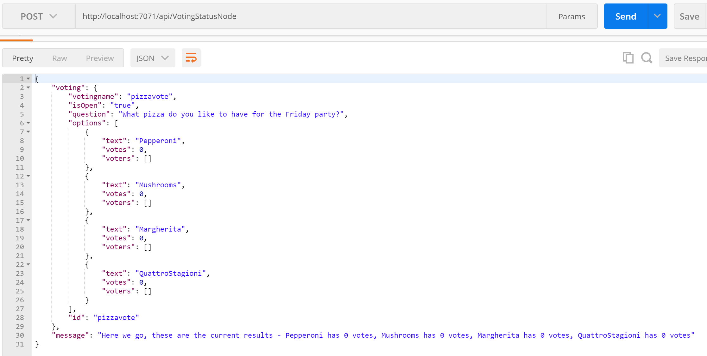

# Voting Service

## Create a serverless service using Node.js and Azure Functions 

## 1. Overview

In this part of the workshop we will create a voting service that allows a team to create polls to vote on, and then surface it from the Squire bot.  


We will be using Node.js, JSON documents, Cosmos DB, and Azure Functions to implement the service. 

### 1.1 Voting Session Document 

The Voting Session document will keep all the information about the voting session, including the question, avaialable options, and the votes. Here is an example JSON document for a Voting session after it's been filled out with a few votes:

```javascript
{
    "votingname": "pizzavote",
    "name": "Pizza Voting",
    "isOpen": true,
    "question": "What pizza do you want?",
    "options": [
        {
            "text": "Pepperoni",
            "votes": 3,
            "voters": ["Thiago", "Jeff", "Raman"]

        },
        {
            "text": "Mushrooms",
            "votes": 1,
            "voters": ["David"]
        },
        {
            "text": "Margherita",
            "votes": 3,
            "voters": ["Donna", "Kanio", "Chris"]
        },
        {
            "text": "Quattro Stagioni",
            "votes": 0
        }
    ]
}
```

### 1.3 Voting Service Operations

Operations | Details
------------ | -------------
Create Voting Session | Create a new voting session
Close / Re-Open Voting| Change status of the voting moving it from active to inactive or vice versa 
Vote | Submit user's vote
Voting Status | Get the latest results from the poll
Delete Voting Session | Remove the voting session from the data store

Each of the operations will map to an Azure Function that we will develop in this module.

## 2. Prerequisites

Ensure you have the following prerequisites before proceeding:

- An active Azure account. If you don't have one, you can sign up for a free account https://azure.microsoft.com/en-us/free/

- Node.js and npm https://nodejs.org/en/download/

- Visual Studio Code https://code.visualstudio.com/Download

- Azure Functions CLI tooling https://www.npmjs.com/package/azure-functions-cli

- RESTful Client that will help you test the functions both locally and when deployed to Azure. One option is Postman https://www.getpostman.com/

## 3. Development 

Now it's time to start building our service. 

### 3.1. Serverless Data Store - Azure Cosmos DB

First, let's prepare our data store - [Azure Cosmos DB](https://docs.microsoft.com/en-us/azure/cosmos-db/introduction). Cosmos DB is Microsoft's globally distributed, multi-model data service. We will use it's document database API called DocumentDB to store the voting session contents for our service. DocumentDB provides rich and familiar SQL query capabilities with consistent low latencies over schema-less JSON data, which is perfect for our service. You can create it on your Azure subscription via the Azure CLI or the Azure Portal:

#### 3.1.1 Create the Cosmos DB Database and Collection via the Azure CLI in the Portal

You can [install the Azure CLI] (https://docs.microsoft.com/en-us/cli/azure/install-azure-cli?view=azure-cli-latest) on your machine, or use it from the [Cloud Shell inside the Azure Portal](https://docs.microsoft.com/en-us/azure/cloud-shell/overview).

Using the Azure CLI, or the Cloud Shell button on the menu in the upper-right of the Azure portal, replace the value of `databaseAccountname` with a unique name, and run the following file to create our Cosmos DB account and collection:

> Note: the Cosmos DB account create step takes a few minutes to finish

```sh
#!/bin/bash

# Set variables for the new account, database, and collection
resourceGroupName='votingbot'
location='eastus'
databaseAccountname='<<<<Replace-with-Your-Unique-Name>>>>'
databaseName='votingbot'
collectionName='votingbot'
partitionkeypath='/votingname'

# Create a resource group
az group create \
	--name $resourceGroupName \
	--location $location

# Create a DocumentDB API Cosmos DB account
az cosmosdb create \
	--name $databaseAccountname \
	--resource-group $resourceGroupName 

# Create a database 
az cosmosdb database create \
	--name $databaseAccountname \
	--db-name $databaseName \
	--resource-group $resourceGroupName

# Create a collection
az cosmosdb collection create \
	--collection-name $collectionName \
	--partition-key-path $partitionkeypath \
	--name $databaseAccountname \
	--db-name $databaseName \
	--throughput 400 \
	--resource-group $resourceGroupName

# Get the database account connection strings
az cosmosdb list-keys \
    --name $databaseAccountname \
    --resource-group $resourceGroupName
```
At the end of running the commands you should have access to the Cosmos DB account keys. Copy the value of the primaryMasterKey and save it. Soon we will add it to the local settings file in Visual Studio Code.

#### 3.1.2 Optional: Create the Cosmos DB Database and Collection via the Azure Portal

Follow these instructions if you didn't use the Azure CLI or Cloud Shell to create the data store and prefer to use the Azure Portal.

1. Login in to the [Azure Portal](https://portal.azure.com)

2. In the left pane, click New, click Databases, and then under Azure Cosmos DB, click Create. Create a new Cosmos DB account wit the following values:

Field | Value
------------ | -------------
Id | <<<make up a unique name for you!>>>
API | SQL (DocumentDB) 
Subscription | Your subscription (should already be selected)
Resource Group | Create new, votingbot
Location | East US

Here is an example:


> Note: this Cosmos DB account create step takes a few minutes to finish

3. After the account is created, create a new collection and a database with the following values (the same values as in the pritscreen):

Field | Value
------------ | -------------
Collection Id | votingbot
Storage Capacity | Fixed (10GB) 
Initial Throughput Capacity | 400
Partition Key | /votingname
Database | Use Existing, votingbot

 A partition key is a property (or path) within your documents that is used to distribute your data among the servers or partitions for scale.
 


4. Next we need to get the database connection string.You can find it under the section Keys in the left menu on the main screen for your Azure Cosmos DB account


Copy the value of the Primary Connection String and save it. Soon we will add it to the local settings file in Visual Studio Code. 

Now we are ready to start creating our voting service using the Azure Functions CLI and Visual Studio Code! In the next section we will walk you through the process.

### 3.2. Create Voting Function

Create a folder called `VotingBot` on your machine. It will contain all the code for our functions. 
Next let's use the Azure Functions CLI to create a new Function app in the current folder, initialize a git repo, and create the first function in the app. From the Terminal, in the `VotingBot` folder, enter the following commands: 

```javascript
//This initializes the function app and repo
func init

//This creates a new function in the function app
func new 
// next select JavaScript
// next select HttpTrigger 
// next provide CreateVotingNode as the name of the function

// this will open Visual Studio Code with your function app and the new CreateVotingNode function in it
code . 
```

Next let's modify the main files for this function.

Modify the `appsettings.json` file in the `VotingBot` folder and add a `votingbot_DOCUMENTDB` entry to the values section, then update the connection string with the values for your Cosmos DB account name and the primary key, or connection string, that you copied earlier:

```javascript
{
  "IsEncrypted": false,
  "Values": {
    "AzureWebJobsStorage": "",
    "votingbot_DOCUMENTDB": "AccountEndpoint=https://<<<<Replace-with-Your-CosmosDB-Account-Name>>>>.documents.azure.com:443/;AccountKey=<<<<Replace-with-Your-CosmosDB-Primary-Key>>>>;"
  }
}

```

This `appsettings.json` file is where you can put local values to be used by all your functions in this function app.

The function will be triggered via an HTTP call (HttpTrigger), and will have a Cosmos DB Binding. Before continuing [learn more about Azure Functions triggers and bindings here](https://docs.microsoft.com/en-us/azure/azure-functions/functions-triggers-bindings). 

In Visual Studio Code modify the `function.json` file in the `CreateVotingode` folder to define the trigger and bindings as follows:

```javascript
{
  "bindings": [
    {
      "authLevel": "function",
      "type": "httpTrigger",
      "direction": "in",
      "methods": [ "post" ],
      "name": "req"
    },
    {
      "type": "http",
      "direction": "out",
      "name": "res"
    },
    {
      "type": "documentDB",
      "name": "outputDocument",
      "databaseName": "votingbot",
      "collectionName": "votingbot",
      "createIfNotExists": true,
      "connection": "votingbot_DOCUMENTDB",
      "direction": "out",
      "partitionKey": "/votingname"
    }
  ],
  "disabled": false
}
```

The main logic inside the function will be to add votes and voters fields to the voting options, and then use the documentDB binding to save the session to our data store.
Now change the contents of `index.js` with the following code. This file contains all the code logic for this function:

```javascript

module.exports = function (context, req) {
    context.log('JavaScript HTTP trigger function processed a request.');

    if (req.body && req.body.votingname && req.body.question && req.body.options) {
        var body = req.body;
        var votingname = body.votingname.replace(/\s/g,'').toLowerCase();
        body.votingname = votingname;
        body.id = votingname;
        var optionsValues = req.body.options.replace(/\s/g,'').split(",");
        var options = [];
        for(var i=0; i< optionsValues.length; i++){
            var option = {};
            option.text = optionsValues[i];
            option.votes = 0;
            option.voters = [];
            options.push(option);
        }

        body.options = options;

        context.bindings.outputDocument = body;

        var responseBody = {};
        responseBody.voting = body;
        responseBody.message =  "Wow! Voting with id '" + votingname + "' was created!";

        context.res = {
            status: 201, 
            body:responseBody
        };
    }
    else {
        context.res = {
            status: 400,
            body: { "message" : "Please pass a voting object in the request body"}
        };
    }
    context.done();
};

```

Now it is time to test the function. Again, in the Integrated Terminal, type 
```javascript
cd ..
func host start
```

Follow the instructions in the prompt and soon you will see from the logs that the function is running locally on http://localhost:7071/api/CreateVotingNode

Now we are ready to test the function. In this function we create the voting session by accepting POST requests with the following JSON body, so this will be the object we process in the body of the function:
```javascript
{
    "votingname": "pizza vote",
    "isOpen": true,
    "question": "What pizza do you want?",
    "options": "Pepperoni, Mushrooms, Margherita, Quattro Stagioni"
}
``` 

One option is to use Postman on that URL, with the content of a Voting Session without the ids. As a result, if it's successful, we will get the document we created in Azure Cosmos DB with the ids:


You can also debug the function - once the function is running, in Visual Studio Code, in the Debug view, select Attach to Azure Functions. You can attach breakpoints, inspect variables, and step through code. Try it out!

### 3.3. Serverless Function - Close / Re-Open Voting Session

In this function we will disable or enable a voting session by modifying the value of `isOpen` in the stored voting session document.

 From the `VotingBot` folder in the command prompt executing the following commands:

```javascript
//This creates a new function in the function app
func new 
// next select JavaScript
// next select HttpTrigger 
// next provide CloseVotingNode as the name of the function

// this will open Visual Studio Code with your function app and the new CloseVotingNode function in it. If you already have it open you can skip this command
code . 
```

This function will accept POST request with the following request object:

```javascript
{
	"id":"pizzavote",
	"isOpen":false
}
```

You can change isOpen to true or false to open or close a voting session.

The bindings configuration for this function is different from the Create Voting function. We define both an in binding to find the existing document using the `votingname` value from the request, and an output binding to update the document on our data store. Update `function.json` in the `CloseVotingNode` folder with the following:

```javascript
{
  "disabled": false,
  "bindings": [
    {
      "authLevel": "function",
      "type": "httpTrigger",
      "direction": "in",
      "methods": [ "post" ],
      "name": "req"
    },
    {
      "type": "http",
      "direction": "out",
      "name": "res"
    },
    {
      "type": "documentDB",
      "name": "inputDocument",
      "databaseName": "votingbot",
      "collectionName": "votingbot",
      "sqlQuery": "SELECT * from c where c.id = {id}",
      "connection": "votingbot_DOCUMENTDB",
      "direction": "in"
    },
    {
      "type": "documentDB",
      "name": "outputDocument",
      "databaseName": "votingbot",
      "collectionName": "votingbot",
      "connection": "votingbot_DOCUMENTDB",
      "direction": "out"     
    }
  ]
}
```

In this function the bindings do a lot of the work for us. Update `index.js` in the `CloseVotingNode` folder with the following:

```javascript
module.exports = function (context, req) {
    context.log('JavaScript HTTP trigger function processed a request.');

     if (req.body && req.body.id && req.body.isOpen != null) {

        if (context.bindings.inputDocument && context.bindings.inputDocument.length == 1)
        {
            var voting =  context.bindings.inputDocument[0];
            context.bindings.outputDocument = voting;
            context.bindings.outputDocument.isOpen = req.body.isOpen;

            var responseBody = {
            "voting" : {
                "votingname" : voting.votingname,
                "isOpen" : voting.isOpen,
                "question" : voting.question,
                "options" : voting.options,
                "id" : voting.id
            },
            "message" : "Nice! Voting with id '" + req.body.id + "' was updated!"
        };

            context.res = {
                status: 200,
                body: responseBody
            };
            context.done(null, context.res); 
        }
        else {
            context.res = {
                status: 400,
                body: { "message" : "Record with this votingname can not be found. Please pass a votingname of an existing document in the request body"}
            }; 
                context.done(null, context.res); 
        };
    }
    else {
        res = {
            status: 400,
            body: "Please pass a votingname and isOpen value in the request body"
        };

        context.done(null, res);
    }
};
```

Let's run and test the function in the same way we did in Create Voting function. You will notice that the URL for this function is at http://localhost:7071/api/CloseVotingNode and you can test it as follows:


### 3.4.  Serverless Function - Vote on a Voting Session

In this function we will receive votes and update the voting session.

From the `VotingBot` folder in the command prompt executing the following commands:

```javascript
//This creates a new function in the function app
func new 
// next select JavaScript
// next select HttpTrigger 
// next provide VoteNode as the name of the function

// this will open Visual Studio Code with your function app and the new VoteNode function in it. If you already have it open you can skip this command
code . 
```

The function will work with the following request object:

```javascript
{
    "id": "pizzavote",
    "user": "Ted",
    "option": "QuattroStagioni"
}
```

Update `function.json` in the `VoteNode` folder as follows to include an output binding for our data store, it's the same as the previous function:


```javascript
{
  "disabled": false,
  "bindings": [
    {
      "authLevel": "function",
      "type": "httpTrigger",
      "direction": "in",
      "methods": [ "post" ],
      "name": "req"
    },
    {
      "type": "http",
      "direction": "out",
      "name": "res"
    },
    {
      "type": "documentDB",
      "name": "inputDocument",
      "databaseName": "votingbot",
      "collectionName": "votingbot",
      "sqlQuery": "SELECT * from c where c.id = {id}",
      "connection": "votingbot_DOCUMENTDB",
      "direction": "in"
    },
    {
      "type": "documentDB",
      "name": "outputDocument",
      "databaseName": "votingbot",
      "collectionName": "votingbot",
      "connection": "votingbot_DOCUMENTDB",
      "direction": "out"     
    }
  ]
}
```

The logic for this function is to update the Voting Session document with a new vote based on the data we are getting from the request. Update `index.js` in the `VoteNode` folder with the following:

```javascript
module.exports = function (context, req) {
    context.log('JavaScript HTTP trigger function processed a request.');

    if (req.body && req.body.id && req.body.user && req.body.option) {
        if (context.bindings.inputDocument && context.bindings.inputDocument.length == 1)
        {
            var body = context.bindings.inputDocument[0];
            var found = false;
            var alreadyset = false;
            for (var index = 0; index < body.options.length; ++index) {
                if (body.options[index].text.toLowerCase() == req.body.option.toLowerCase()) {
                    found = true;
                    for (var index2 = 0; index2 < body.options[index].voters.length; index2++) {
                        if (body.options[index].voters[index2].toLowerCase() == req.body.user.toLowerCase()) {
                            context.res = {
                                status: 201,
                                body: { "message" : "Vote was already there, nothing updated" }
                            };
                            alreadyset = true;
                            break;
                        }
                    }
                    if (found & !alreadyset){
                        body.options[index].votes++;
                        body.options[index].voters.push(req.body.user);
                    }
                    break;
                }
            }
            if (found & !alreadyset){
                context.bindings.outputDocument = body;

                var responseBody = {
                    "voting" : {
                        "votingname" : body.votingname,
                        "isOpen" : body.isOpen,
                        "question" : body.question,
                        "options" : body.options,
                        "id" : body.id
                    },
                    "message" : "Nice! Your vote was counted!"
                };

                context.res = {
                    status: 201, 
                    body: responseBody
                };
            }
            else {
                if (!alreadyset){
                    context.res = {
                        status: 400,
                        body: { "message" : "No vote option found with value " + req.body.option + " in voting session " + req.body.id }
                    }
                }           
            }
        }
        else {
            context.res = {
                status: 400,
                body: { "message" : "Record with this id can not be found. Please pass a id of an existing document in the request body" }
            }; 
                context.done(null, context.res); 
        };
    }
    else {
        context.res = {
            status: 400,
            body: { "message" : "Please pass a vote object in the request body" }
        };
    }
    context.done();
};
```
Run and test it similarly to the previous two functions. You should get the new document back. For example:


### 3.5.  Serverless Function - Voting Session Status 

Voting Status will give us the score of a voting session. 

From the `VotingBot` folder in the command prompt executing the following commands:

```javascript
//This creates a new function in the function app
func new 
// next select JavaScript
// next select HttpTrigger 
// next provide VotingStatusNode as the name of the function

// this will open Visual Studio Code with your function app and the new VotingStatusNode function in it. If you already have it open you can skip this command
code . 
```

This functions will accept the GET HTTP method and expect the voting session id in the request URL - http://localhost:7071/api/VotingStatusNode/pizzavote. Notice the change in the bindings to accept the GET method, and expect the votingname in the URL. We map the votingname to the documentDB outputbinding sqlQuery.

Update `function.json` with the following:

```javascript
{
  "disabled": false,
  "bindings": [
    {
      "authLevel": "function",
      "type": "httpTrigger",
      "direction": "in",
      "methods": [ "get" ],
      "route": "VotingStatusNode/{id}",
      "name": "req"
    },
    {
      "type": "http",
      "direction": "out",
      "name": "res"
    },
    {
      "type": "documentDB",
      "name": "inputDocument",
      "databaseName": "votingbot",
      "collectionName": "votingbot",
      "sqlQuery": "SELECT * from c where c.id = {id}",
      "connection": "votingbot_DOCUMENTDB",
      "direction": "in"
    }
  ]
}
```

The binding will return the voting document with all of the votes. We then return the whole voting document:

```javascript
module.exports = function (context, req) {
    context.log('JavaScript HTTP trigger function processed a request.');

    if (context.bindings.inputDocument && context.bindings.inputDocument.length == 1)
    {
        var voting =  context.bindings.inputDocument[0];

        var message = "Here we go, these are the current results - ";

        for(var i=0; i < voting.options.length; i++){
            var votes = voting.options[i].votes;
            message += voting.options[i].text + " has " +  votes + (votes === 1 ? " vote" : " votes");
            if(i < voting.options.length-1 ) { message += ", "}
        }

        var responseBody = {
            "voting" : {
                "votingname" : voting.votingname,
                "isOpen" : voting.isOpen,
                "question" : voting.question,
                "options" : voting.options,
                "id" : voting.id
            },
            "message" : message
        };

        context.res = {
            status : 200,
            body : responseBody
        };
        context.done(null, context.res);
    }
    else {
        context.res = {
            status : 400,
            body: { "message" : "Record with this id can not be found. Please pass an id of an existing document in the request body" }
        };
        context.done(null, context.res);
    }
};
```

Run and test it similarly to the previous functions. For example:


### 3.6.  Serverless Function - Delete Voting Session 

Delete Voting Session will delete the voting session document with all its votes. 

From the `VotingBot` folder in the command prompt executing the following commands:

```javascript
//This creates a new function in the function app
func new 
// next select JavaScript
// next select HttpTrigger 
// next provide DeleteVotingNode as the name of the function

// this will open Visual Studio Code with your function app and the new DeleteVotingNode function in it. If you already have it open you can skip this command
code . 
```

This functions will expect the voting session id in the request body:

```javascript
{
	"id":"pizzavote"
}
```

Update `function.json` with the following:
```javascript
{
  "disabled": false,
  "bindings": [
    {
      "authLevel": "function",
      "type": "httpTrigger",
      "direction": "in",
      "name": "req"
    },
    {
      "type": "http",
      "direction": "out",
      "name": "res"
    },
    {
      "type": "documentDB",
      "name": "inputDocument",
      "databaseName": "votingbot",
      "collectionName": "votingbot",
      "sqlQuery": "SELECT * from c where c.id = {id}",
      "connection": "votingbot_DOCUMENTDB",
      "direction": "in"
    }
  ]
}
```

We can't delete CosmosDB documents using bindings, so we will use the `documentdb` npm package to delete the document. Update `index.js` with the following in the `DeleteVoting` folder:

```javascript
var documentClient = require("documentdb").DocumentClient;
var connectionString = process.env["votingbot_DOCUMENTDB"];
var arr = connectionString.split(';');
var endpoint = arr[0].split('=')[1];
var primaryKey = arr[1].split('=')[1] + "==";
var collectionUrl = 'dbs/votingbot/colls/votingbot';
var client = new documentClient(endpoint, { "masterKey": primaryKey });

module.exports = function (context, req) {
    context.log('JavaScript HTTP trigger function processed a request.');

    if (req.body && req.body.id) {
        if(context.bindings.inputDocument && context.bindings.inputDocument.length == 1) {
            deleteDocument(req.body.id, context.bindings.inputDocument[0].id).then((result) => {
                console.log(`Deleted document: ${req.body.id}`);
                context.res = {
                    status : 201,
                    body: { "message" : `Deleted document: ${req.body.id}` }
                };
                context.done(null, context.res);                
            },
            (err) => {
                context.log('error: ', err);
                context.res = {
                    body: {"message" : "Error: " + JSON.stringify(err) }
                };
                context.done(null, context.res);
            });
        }
        else {
            context.res = {
                status : 400,
                body: { "message" : "Record with this id can not be found. Please pass a id of an existing document in the request body" }
            };
            context.done(null, context.res);
        }
    }
    else {
        res = {
            status: 400,
            body: {"message" : "Please pass a name on the query string or in the request body" }
        };
        context.done(null, res);
    }
};

function deleteDocument(partitionKey, id) {
    let documentUrl = `${collectionUrl}/docs/${id}`;
    console.log(`Deleting document:\n${id}\n`);

    return new Promise((resolve, reject) => {
        client.deleteDocument(documentUrl, {
            partitionKey: [partitionKey] }, (err, result) => {
            if (err) reject(err);
            else {
                resolve(result);
            }
        });
    });
};
```

In this file we are using the `documentdb` npm package. So that you can test the function locally, you need to install the package too. You can easily do that in Visual Studio Code or from the command line / terminal:

1. Open the Integrated Terminal in Visual Studio Code by clicking Ctrl + ` or from the menu View -> Integrated Terminal

2. Navigate to the folder for your function:
```javascript
cd DeleteVotingNode
```

3. Then type
```javascript
npm install documentdb
```

Now it is time to test the function. Again, in the Integrated Terminal, type 
```javascript
cd ..
func host start
```

Run and test it similarly to the previous functions. For example:


## 4. Azure Configuration

In order to get the code running in Azure you need a little bit more work.

1. Push your code in GitHub 
2. Setup Azure Portal CLI following the instructions here - https://docs.microsoft.com/en-us/azure/azure-functions/functions-create-first-azure-function-azure-cli
3. Then deploy your Function App by following the instructions here - https://docs.microsoft.com/en-us/azure/azure-functions/functions-create-first-azure-function-azure-cli

The last step is the configure App Settings. Go again to Platform Features of your Function App and select Application Settings.

You have to set the following App Setting:

Variable | Details
------------ | -------------
votingbot_DOCUMENTDB | connection string for DocumentDB as per previous steps

## 5. Integrate into Squire Bot

!!!!!!!!!!!!!!!!!!!!!!!!!!!!!!!!!!!!!!!!!!!!!!!!!!!!!!!!!!!!!!!!!!!!!!!!!!!!!!!!!!!!!!!!!

INTEGRATE WITH SQUIRE BOT

!!!!!!!!!!!!!!!!!!!!!!!!!!!!!!!!!!!!!!!!!!!!!!!!!!!!!!!!!!!!!!!!!!!!!!!!!!!!!!!!!!!!!!!!!
