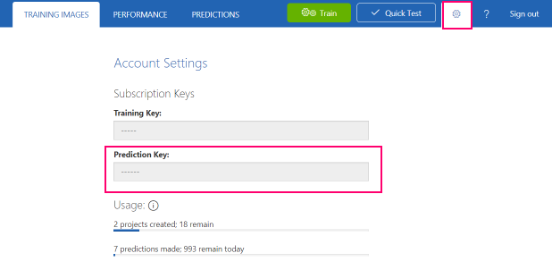

# フォトモザイクボット

今回は [Cognitive Services Custom Vision Service](https://azure.microsoft.com/en-us/services/cognitive-services/custom-vision-service/)　を使って、入力された写真を使ったフォトモザイクを生成するボットを開発します。

例えば、オーランドのランドマークである "Orlando Eye" をカスタムビジョンで認識するようにトレーニングして、Bing 画像検索の結果からモザイクを作るといったことが出来ます。


## 前提条件

1. Visual Studio:
   - [Visual Studio 2017 Update 3](https://www.visualstudio.com/downloads/) および Azure workload 機能のインストール (Windows)
   - [Visual Studio Code](https://code.visualstudio.com/download) で [C# extension](https://code.visualstudio.com/docs/languages/csharp) の追加　(Mac/Linux)

1. Mac/Linux の場合、 [.NET Core 2.0](https://www.microsoft.com/net/core#macos) のインストール

1. Mac/Linx の場合、npm で install [azure\-functions\-core\-tools](https://www.npmjs.com/package/azure-functions-core-tools)@core 実行。詳細はこちらを参照。 https://aka.ms/func-xplat.

1. [Bot Framework Emulator](https://github.com/Microsoft/BotFramework-Emulator/releases/). 

    * 注意: 最新の Mac 用インストーラーで問題がある場合、以前のバージョンを使ってください。 [botframework\-emulator\-3\.5\.19\-mac\.zip](https://github.com/Microsoft/BotFramework-Emulator/releases/download/v3.5.19/botframework-emulator-3.5.19-mac.zip). 起動時に最新の更新を自動で取得します。

1. Azure Storage Account

1. [Azure CLI 2.0](https://docs.microsoft.com/en-us/cli/azure/install-azure-cli?view=azure-cli-latest)

## 1. API キーの作成

1. Bing Search API キー:

    - Azure ポータルより、**+ New** をクリック、**Bing Search APIs** を検索。
    - 必須情報を入力して **S1** インスタンスを利用。

1. (オプション) Computer Vision API キーも合わせて作成。作成するファンクションは カスタムビジョンで画像が認識できない場合、通常の Computer Vision API を使うため必須ではない。

    Computer Vision API キーの作成手順:

    - Azure ポータルで **+ New** をクリック。 **Computer Vision API** を検索。
    - 必須情報を入力して **F0** インスタンスを利用。

## 2. Custom Vision Service プロジェクトの作成

1. https://www.customvision.ai/ に、Microsoft アカウントでログイン。

1. 新しいプロジェクトを作成し、Domains より "Landmarks" を指定。
   
1. 画像を追加し、タグを指定。Chrome のエクステンションである [Bulk Image Downloader](http://www.talkapps.org/bulk-image-downloader) を使ってランドマークの画像を一括ダウンロードも可能。

1. いくつかのランドマークを追加したら、**Train** ボタンをクリック。少なくとも5 の画像と各画像に 2 つのタグを登録。

1. (オプション) **Test** タブからテストが可能。

1. **Performance** タブをクリック。複数の iteration がある場合、最新のものを選択して、**Make default** を選択。


## 3. フォトモザイクプロジェクトの構成

1. git clone などで [photo mosaic project on GitHub](https://github.com/Azure-Samples/functions-dotnet-photo-mosaic) からプロジェクトを取得

   - Windows  の場合は `master` ブランチを使用
   - Mac/Linux の場合は `core` ブランチを使用

1. Azure ポータルで利用するストレージアカウントを選択。ない場合は作成。

1. ターミナルを開き、**functions-dotnet-photo-mosaic** に移動して、以下のコマンドを実行。

    ```
    az login
    python <Storage Account Name> <Resource group>
    ```

    この操作で **local.settings.json** が変更されます。

    または Azure ポータル上で Azure Cloud Shell を開き、 `python` を選択してスクリプトを実行。表示された結果を`local.settings.json`に手動で反映。 

    "Setup successful!" が表示されることを確認。

1. Visual Studio を利用している場合、**MosaicMaker.sln** を開く。Mac の場合は **functions-dotnet-photo-mosaic** フォルダーを Visual Studio
 Code で開く。 

1. **MosaicMaker/local.settings.json** ファイルを開く。

1. [Custom Vision ポータル](https://www.customvision.ai/), で Performance のタブより **Prediction URL** を選択。**If you have an image file** にある URL をコピーし、 **local.settings.json** ファイルの `PredictionApiUrl` にペースト。

1. Custom Vision ポータルで設定ギアアイコンをクリックして、**Prediction Key** をコピー。`PredictionApiKey` にペースト。

    

1. Azure ポータルより Bing Search APIs を開き、**Keys** メニューよりキーをコピー。`SearchAPIKey` にペースト。

1. (オプション) Cognitive Services Vision Service のキーを `MicrosoftVisionApiKey` にペースト。

### App Settings のサマリー

| キー                  | 説明 |
|-----                 | ------|
| AzureWebJobsStorage  | ストレージアカウントの接続文字列 |
| SearchAPIKey         | [Bing Search API](https://azure.microsoft.com/en-us/services/cognitive-services/bing-web-search-api/) のキー |
| MicrosoftVisionApiKey | [Computer Vision Service](https://azure.microsoft.com/en-us/services/cognitive-services/computer-vision/) のキー |
| PredictionApiUrl     | [Cognitive Services Custom Vision Service](https://azure.microsoft.com/en-us/services/cognitive-services/custom-vision-service/) のエンドポイント URL ("image" で終わる方) |
| PredictionApiKey     | [Cognitive Services Custom Vision Service](https://azure.microsoft.com/en-us/services/cognitive-services/custom-vision-service/) のキー |
| generate-mosaic      | ストレージキューの名前。既定で "generate-mosaic" |
| input-container      | 入力イメージのストレージコンテナの名前。既定で "input-images" |
| output-container     | 出力イメージのストレージコンテナの名前。既定で "mosaic-output" |
| tile-image-container | モザイクタイルイメージのストレージコンテナの名前。既定で "tile-images" |
| SITEURL              | `http://localhost:7072` に設定。Azure 展開時は不要。 |
| STORAGE_URL          | ストレージアカウントの URL `https://accountname.blob.core.windows.net/` |
| CONTAINER_SAS        | 入力コンテナへのファイルアップロード用 SAS トークン "?" から始まる。 |
| APPINSIGHTS_INSTRUMENTATIONKEY | (オプション) Application Insights 用キー | 
| MosaicTileWidth      | Default width of each mosaic tile. |
| MosaicTileHeight     | Default height of each mosaic tile. |

Azure 上でこれらの値を設定したい場合は、**local.settings.json** に値を設定して、Azure Functions Core Tools で公開。

```
func azure functionapp publish function-app-name --publish-app-settings
```

## 4. プロジェクトの実行

1. コンパイルして実行:

    - Visual Studio を使っている場合、PhotoMosaic.sln を開き、F5 を押下。

    - VS Code を Mac で使っている場合は、ビルドタスクが `dotnet build` を実行。その後 output フォルダに移動して、ファンクション実行。

        ```
        cd MosaicMaker/bin/Debug/netstandard2.0/osx
        func host start
        ```

    以下のような結果が表示される。

    ```
    Http Functions:

            RequestMosaic: http://localhost:7072/api/RequestMosaic

            Settings: http://localhost:7072/api/Settings

    [10/4/2017 10:24:20 PM] Host lock lease acquired by instance ID '000000000000000000000000C9A597BE'.
    [10/4/2017 10:24:20 PM] Found the following functions:
    [10/4/2017 10:24:20 PM] MosaicMaker.MosaicBuilder.RequestImageProcessing
    [10/4/2017 10:24:20 PM] MosaicMaker.MosaicBuilder.Settings
    [10/4/2017 10:24:20 PM] MosaicMaker.MosaicBuilder.CreateMosaicAsync
    [10/4/2017 10:24:20 PM]
    [10/4/2017 10:24:20 PM] Job host started
    Debugger listening on [::]:5858
    ```

2. ファンクションが起動しているかは、 [http://localhost:7072/api/Settings](http://localhost:7072/api/Settings) にアクセスして確認。

## 5. ボットでの利用

1. Squire UX にて、以下のスキルを追加。

    |フィールド|値|
    |--|--|
    |Title|generate mosaic|
    |Description|Generate a photo mosaic|
    |Method|POST|
    |URL| http://localhost:7072/api/RequestMosaic|
    |Parameter Name|InputImageUrl|
    |Parameter Prompt|What is the source image URL?|

2. ボットで `generate mosaic` を送信。既にトレーニング済みのトレードマーク写真を Google や Bing 画像の URL として送信。

3. Bot はモザイクを作成したのち、URL を返信。ファンクションのアウトプットから作成が成功したことを確認。

    ```
    [10/4/2017 1:34:55 AM] Executing 'CreateMosaic' (Reason='New queue message detected on 'generate-mosaic'.', Id=a1d2a381-4eb6-4d82-8dc9-324ad90932c4)
    [10/4/2017 1:34:57 AM] Tag: Space Needle, Probability 1
    [10/4/2017 1:34:57 AM]

    Image analysis: Space Needle

    [10/4/2017 1:34:57 AM] Query hash: 439222976
    [10/4/2017 1:34:59 AM] Generating mosaic...
    [10/4/2017 1:34:59 AM] Time to generate mosaic: 344.2114
    [10/4/2017 1:34:59 AM] Function completed (Success, Id=a1d2a381-4eb6-4d82-8dc9-324ad90932c4, Duration=4993ms)
    [10/4/2017 1:34:59 AM] Executed 'CreateMosaic' (Succeeded, Id=a1d2a381-4eb6-4d82-8dc9-324ad90932c4)
    ```

## (オプション) 6. 手動での実行

直接手動で実行したい場合、以下の URL に Postman 等で POST リクエストを送信。

`POST http://localhost:7072/api/RequestMosaic`

Body: 
```json
{
"InputImageUrl": "http://url.of.your.image",
"ImageContentString": "optional keyword for mosaic tiles",
"TilePixels": 20 
}
```
