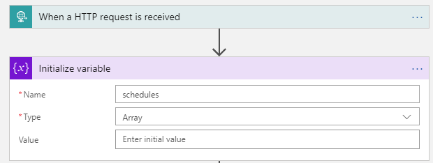
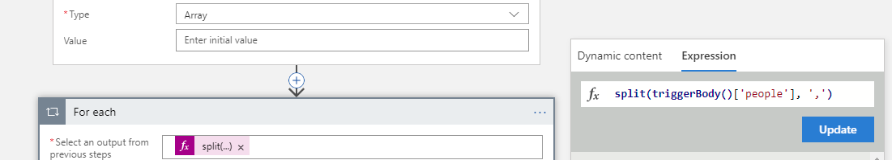
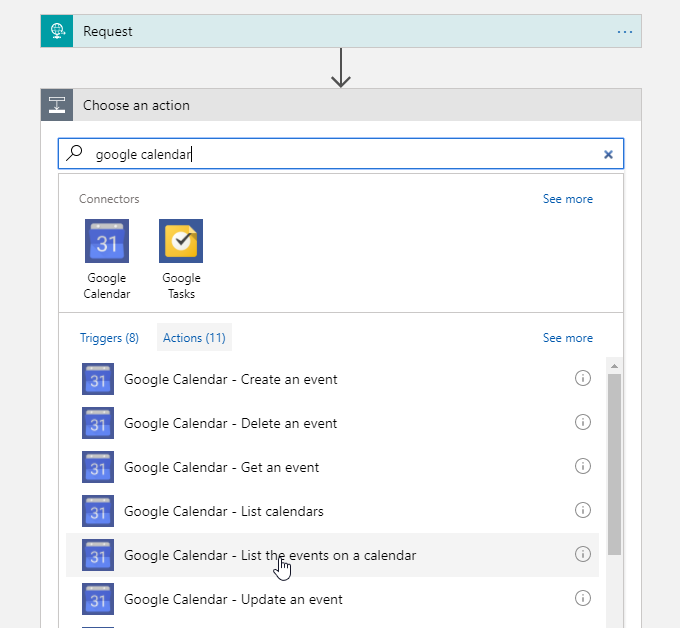
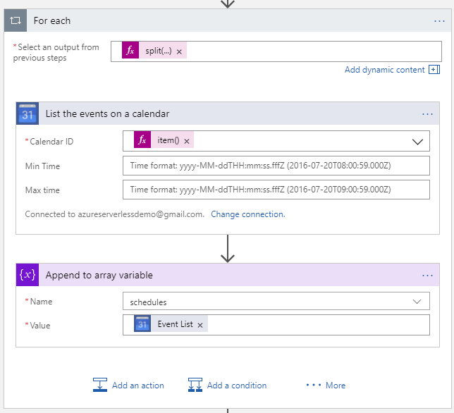
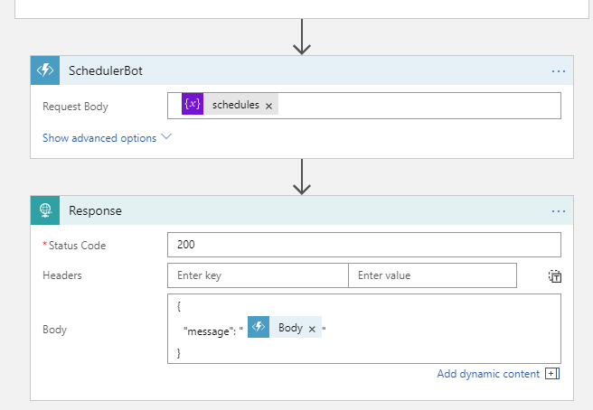

# Add a team schedule module to your bot

## Overview

In this module we will use Azure Functions and Logic Apps to build in functionality that integrates with team calendars.  The idea is you can ask your bot to find a suitable meeting time between teammates, and it will respond back with available times.

The eventual flow will be:  
1. Bot is notified of a command to find schedules `Schedule appointment` for `jeff,thiago`
1. Logic Apps goes and grabs the calendar details for each person provided
1. A Function is called to calculate availability in calendars
1. A response is returned to the user with available times

## Building the function

1. In your function app on your machine, create a new javascript function called `SchedulerBot`
    * `func new` -> `JavaScript` -> `HttpTrigger`
1. Open the new function in Visual Studio Code: `code .`
1. In the new `index.js` file, overwrite with the following: [code snippet](src/step-1/index.js)
    * This code will run and return any available slot within a set of scheduled events.  
1. Test to make sure the function works
    * `func run .` -> do a POST on the exposed URL locally `http://localhost:7071/api/SchedulerBot`

**Response from step-1 index.js**

```javascript
{
    "availableSlots": 1,
    "availableTime": [
        {
            "start": "14:01:00",
            "end": "17:00:00"
        }
    ]
}
```

This is stating that there is one available timeslot between 2:01pm and 5:00pm.

1. Go back to the `index.js` file and replace the 

```javascript
var scheduledEvents = [
        {
            "start": "8:00:00",
            "end": "14:00:00"
        }
    ];

    //TODO: Change scheduled events to events from Google Calendar
```

with this snippet: [code snippet](src/step-2/index.snippet.js)  (the full index.js should look [like this](src/step-2/index.js))

1. Run the function again after saving changes, and this time when you POST, post with the following JSON body: [sample JSON](src/step-2/sample.json)

**Response from step-2 index.js with sample.json body**
```javascript
{
    "availableSlots": 2,
    "availableTime": [
        {
            "start": "08:00:00",
            "end": "09:29:00"
        },
        {
            "start": "16:01:00",
            "end": "17:00:00"
        }
    ]
}
```
1. Publish the function app to Azure
    * `func azure functionapp publish {yourAzureFunctionAppName}`  

Now the function can correctly return back available times - we just need to write a Logic App to pull in calendar data.

## Building the Logic App

1. Go to the [Azure Portal](https://portal.azure.com)
1. Create a new logic app called `scheduler-bot` in any region you prefer
1. Open the logic app and add a `Request` trigger
1. Click on the `Use sample payload to generate schema` button to specify the shape of the request.
1. Paste in the following example request from the bot:  
    ```json
    {
        "people": "azureserverlessdemo@gmail.com,ujmqvr5ouk8p9nmia2o4h6o33o@group.calendar.google.com"
    }
    ```
    This is specifying that the bot will send in a "people" parameter.
1. Now we need to initialize a variable that will store each event schedule.  Add a step for **Initialize variable**.  Name the variable **schedules**, make it an Array, and you can leave the value empty.  
    
1. Add a New step, and under **..More** select **Add a for each** as we need to grab calendar details FOR EACH of the `people` from the trigger.
1. In the `Select an output from previous steps`, select the **Expression** tab on the right and type in the following expression to split the people by a `,`: `split(triggerBody()['people'], ',')` -> then press **OK**  
    **HINT**: If you don't see expressions, zoom your browser out. You may be in "responsive" mode.  
    
1. Add an action - **Google Calendar - List the events on a calendar**  
  
1. Sign in with the following account:
    * username: `azureserverlessdemo@gmail.com`
    * password: `s3rverless1`
1. For the **Calendar ID** select **Enter custom value**.  Choose another expression to get the current item of the foreach loop.  The expression is: `item()`
1. Add another step in the foreach to **Append to array variable** - append the **Event List** to the "schedules" array.  
      
1. After/outside the foreach, call the function to evaluate the responses.
    * Add a function, select your app, select the `ScheduleBot` function
    * Pass in the **schedules** variable to the function
1. Add a response after the function, paste in the following to return a message to the bot:  
    ```json
    {
    "message": "@{body('SchedulerBot')}"
    }
    ```  
    
1. Save the logic app, and grab the trigger invoke URL from the trigger

## Train the bot
Go to the Squire UX and add a new skill.


|Field|Value|
|--|--|
|Title|Schedule appointment|
|Description|Get available time to meet with people|
|Method|POST|
|URL|*Copy the URL from your Logic app trigger*|
|Parameter Name|people|
|Parameter Prompt|Who do you want to schedule it with? (Comma seperated)|


Go to your bot and ask it to `Schedule appointment`.

When it asks with whom, paste in the following 2 google calendars:
`azureserverlessdemo@gmail.com,ujmqvr5ouk8p9nmia2o4h6o33o@group.calendar.google.com`

We could continue to improve the bot by adding in some aliases for the Logic App via CosmosDB or some other store. For instance `jeff` could substitute to `azureserverlessdemo@gmail.com`, making the bot easier to communicate with. For sake of simplicity we will leave as-is for now.