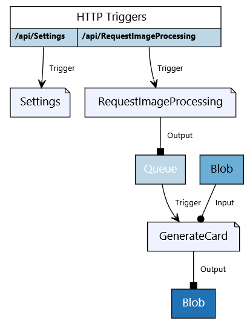

# Coder Cards: ギークなトレーディングカードを自動生成

CoderCards はギークなトレーディングカードを自動生成します。Microsoft Cognitive Services を利用して顔の表情を解析、その結果によってカードを返します。

## 前提条件

1. Visual Studio:
   - [Visual Studio 2017 Update 3](https://www.visualstudio.com/downloads/) および Azure workload 機能のインストール (Windows)
   - [Visual Studio Code](https://code.visualstudio.com/download) で [C# extension](https://code.visualstudio.com/docs/languages/csharp) の追加　(Mac/Linux)

1. Mac/Linux の場合、 [.NET Core 2.0](https://www.microsoft.com/net/core#macos) のインストール

1. Mac/Linx の場合、npm で install [azure\-functions\-core\-tools](https://www.npmjs.com/package/azure-functions-core-tools)@core 実行。詳細はこちらを参照。 https://aka.ms/func-xplat

1. [Azure Storage Explorer](https://azure.microsoft.com/en-us/features/storage-explorer/)

1. [Bot Framework Emulator](https://github.com/Microsoft/BotFramework-Emulator/releases/)

    * 注意: 最新の Mac 用インストーラーで問題がある場合、以前のバージョンを使ってください。 [botframework\-emulator\-3\.5\.19\-mac\.zip](https://github.com/Microsoft/BotFramework-Emulator/releases/download/v3.5.19/botframework-emulator-3.5.19-mac.zip). 起動時に最新の更新を自動で取得します。

1. Azure Storage Account

1. [Azure CLI 2.0](https://docs.microsoft.com/en-us/cli/azure/install-azure-cli?view=azure-cli-latest)


## CoderCards について

* このプロジェクトでは 2 つの機能が提供されます。:
  * **RequestImageProcessing**. HTTP でトリガーされ、キューにメッセージを書き込み明日。要求のペイロードは以下のスキーマとなります。:

  ```json
      {
        "PersonName": "Scott Guthrie",
        "Title": "Red Polo Connoisseur",
        "BlobName": "Scott Guthrie-Red Polo Connoisseur.jpg"
      }
  ```

  * **GenerateCard**. キューの書き込みでトリガーされ、ペイロードにある Blob の情報を使います。入力されたイメージの感情を解析し、4 つのテンプレートからカードを生成します。
     
     * カードは App Setting で指定された `output-container`に書き出されます。 

以下が [Azure Functions Bindings Visualizer](https://functions-visualizer.azurewebsites.net) を使って生成されたバインディングの情報です。:



## 1. Emotion API キーの作成

1. Cognitive Services Emotion API キー: 

    - Azure ポータルで **+ New** をクリック。 **Emotion API** を検索。
    - 必須情報を入力して **F0** インスタンスを利用。

## 2. CoderCards project の構成

1. git clone などで [CoderCards project on GitHub](https://github.com/Azure-Samples/functions-dotnet-codercards) からプロジェクトを取得。

    - Windows  の場合は `master` ブランチを使用
    - Mac/Linux の場合は `core` ブランチを使用

1. Azure ポータルで利用するストレージアカウントを選択。ない場合は作成。

1. ターミナルを開き、**functions-dotnet-codercards** に移動して、以下のコマンドを実行。

    ```
    az login
    python setup.py <Storage Account Name> <Resource group> true
    ```

    この操作で **local.settings.json** が変更されます。エラーが出る場合は、Python 3 がインストールされているか確認し、python3 を実行してください。最後の引数は local プリフィックスを付けるか決めるもので、これでローカル用と Azure 用の構成を作成可能です。

1. Visual Studio を利用している場合、**CoderCards.sln** を開く。Mac の場合は **functions-dotnet-codercards** フォルダーを Visual Studio
 Code で開く。 

1. **CoderCards/local.settings.json** ファイルを開く。

1. Azure ポータルより Emotion API を開き、**Keys** メニューよりキーをコピー。`EmotionAPIKey` にペースト。

1.  **local.settings.json** に以下の `Host` 設定を `Values` に並べて追加。

    ```json
    {
        "IsEncrypted": false,
        "Host": {
            "LocalHttpPort": 7072,
            "CORS": "*"
        },
        "Values": {
            ...
        }
    }
    ```

### App Settings のサマリー

| キー                  | 説明 |
|-----                | ------|
| AzureWebJobsStorage | ストレージアカウントの接続文字列 |
| EmotionAPIKey       | [Cognitive Services Emotion API](https://www.microsoft.com/cognitive-services/en-us/emotion-api) のキー |
| input-queue         |  カード生成のトリガーとなるキューの名前。ローカルの場合は "local-queue"、Azure の場合は "input-queue" を利用 |
| input-container     | 入力イメージのストレージコンテナの名前。 ローカルの場合は "input-local"、Azure の場合は "card-input" を利用 |
| output-container     | 出力イメージのストレージコンテナの名前。 ローカルの場合は "output-local"、Azure の場合は "card-output" を利用 |
| SITEURL              | `http://localhost:7072` に設定。Azure 展開時は不要。 |
| STORAGE_URL          | ストレージアカウントの URL `https://accountname.blob.core.windows.net/` |
| CONTAINER_SAS        | 入力コンテナへのファイルアップロード用 SAS トークン "?" から始まる。 |

Azure 上でこれらの値を設定したい場合は、**local.settings.json** に値を設定して、Azure Functions Core Tools で公開。

```
func azure functionapp publish function-app-name --publish-app-settings
```

## 3. プロジェクトの実行

1.コンパイルして実行:

    - Visual Studio を使っている場合、**CoderCards.sln** を開き、F5 を押下。

    - VS Code を Mac で使っている場合は、ビルドタスクが `dotnet build` を実行。その後 output フォルダに移動して、ファンクション実行。

        ```
        cd CoderCards/bin/Debug/netstandard2.0/osx/publish
        func host start
        ```

     以下のような結果が表示される。

    ```
    Http Functions:

        Settings: http://localhost:7072/api/Settings

        RequestImageProcessing: http://localhost:7072/api/RequestImageProcessing

    [10/6/17 7:01:18 AM] Found the following functions:
    [10/6/17 7:01:18 AM] Host.Functions.Settings
    [10/6/17 7:01:18 AM] Host.Functions.GenerateCard
    [10/6/17 7:01:18 AM] Host.Functions.RequestImageProcessing
    [10/6/17 7:01:18 AM] 
    [10/6/17 7:01:18 AM] Job host started
    [10/6/17 7:01:18 AM] Host lock lease acquired by instance ID '0000000000000000000000005CADA547'.
    ```

2. ファンクションが起動しているかは、 [http://localhost:7072/api/Settings](http://localhost:7072/api/Settings) にアクセスして確認。

## ボットでの利用

1. Squire UX にて、以下のスキルを追加。

    |Field|Value|
    |--|--|
    |Title|generate CoderCard|
    |Description|Generate a CoderCard|
    |Method|POST|
    |URL| http://localhost:7072/api/RequestImageProcessing|
    |Parameter Name|BlobName|
    |Parameter Prompt|What is the source image URL?|
    |Parameter Name|PersonName|
    |Parameter Prompt|What is the person name?|
    |Parameter Name|Title|
    |Parameter Prompt|What is the person's title?|

1. Azure Storage explorer で利用しているアカウントに接続. 

    - `input-local` コンテナを選択。
    - **Set public access level** を右クリック。
    - **Public read access for blobs only** を選択。

2. 正方形の画像を `input-local` に保存して、ファイル名をコピー。

2. ボットで `generate CoderCard`を送信。アップロードしたファイル名を送信。

3. ファンクションのアウトプットから作成が成功したことを確認。生成されたカードは `output-local` コンテナに作成されるので、 Azure Storage Explorer で確認。

    ```
    [10/4/2017 1:34:59 AM] Function completed (Success, Id=a1d2a381-4eb6-4d82-8dc9-324ad90932c4, Duration=4993ms)
    [10/4/2017 1:34:59 AM] Executed 'GenerateCard' (Succeeded, Id=a1d2a381-4eb6-4d82-8dc9-324ad90932c4)
    ```

## (オプション) 5. CoderCards SPA の利用

1. Functions ホストをポート 7071 で実行。**local.settings.json** の設定を変更するか、 `func host start --port 7071`コマンドを実行。

2. コマンドプロンプトで `CoderCardsClient` フォルダに移動して、以下を実行。

    - Run `npm install`
    - Run `npm start`. これでサイトが `http://127.0.0.1:8080/`で開始。 


## (オプション) 6. 手動での実行 

1. 正方形の画像を `input-local` コンテナにアップロード。(正方形でない画像はストレッチされる)

1. Postman 等で POST 要求を送信。

    `POST http://localhost:7072/api/RequestImageProcessing`

    ```json
    {
      "PersonName": "My Name", 
      "Title": "My Title",
      "BlobName": "BlobFilename.jpg"
    }
    ```
