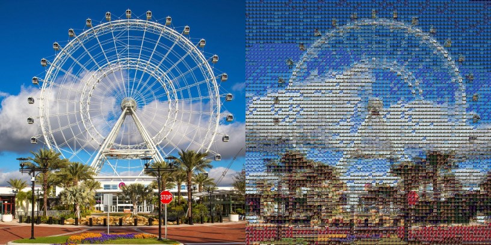
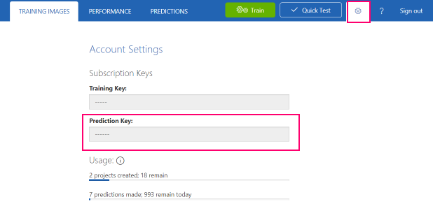

# Photo Mosaic Bot

This bot will generate a photo mosaic of an input image, using [Cognitive Services Custom Vision Service](https://azure.microsoft.com/en-us/services/cognitive-services/custom-vision-service/) to generate a photo mosaic from an input image.

For example, you can train your model with Orlando landmarks, such as the Orlando Eye. Custom Vision will recognize an image of the Orlando Eye, and the function will create a photo mosaic composed of Bing image search results for "Orlando Eye." See example below.



## Prerequisites

1. Bot Framework Emulator - https://github.com/Microsoft/BotFramework-Emulator/releases/. If installing on a Mac, there's a problem with the latest installers. So, install [botframework\-emulator\-3\.5\.19\-mac\.zip](https://github.com/Microsoft/BotFramework-Emulator/releases/download/v3.5.19/botframework-emulator-3.5.19-mac.zip). The emulator will automatically download updates when it launches, and you simply have to restart it once that is complete.

1. Visual Studio, either:
   - Visual Studio 2017 Update 3 with the Azure workload installed (Windows)
   - Visual Studio Code with the [C# extension](https://code.visualstudio.com/docs/languages/csharp) (Mac/Linux)

1. If running on a Mac/Linux, [.NET Core 2.0](https://www.microsoft.com/net/core#macos)

1. If running on a Mac/Linx, install [azure\-functions\-core\-tools](https://www.npmjs.com/package/azure-functions-core-tools) from npm

1. Azure Storage Account

1. [Azure CLI 2.0](https://docs.microsoft.com/en-us/cli/azure/install-azure-cli?view=azure-cli-latest)

## 1. Create API keys

1. Create a Bing Search API key:

    - In the Azure portal, click **+ New** and search for **Bing Search APIs**. 
    - Enter the required information in the Create blade. You may use the lowest service tier of **S1** for this module.

1. (Optional) Create a Computer Vision API key. The function will fall back to the regular Computer Vision API if there isn't a match with images that have been trained in the Custom Vision Service. If you plan to test only with images that will match custom vision, you can skip this step.

    To create a Computer Vision API key:

    - In the Azure portal, click **+ New** and search for **Bing Search APIs**.
    - Enter the required information in the Create blade. You may use the free tier **F0** for this module.

## 2. Set up Custom Vision Service project

1. Go to https://www.customvision.ai/

1. Sign in with a Microsoft account

1. Create a new project and select the image type, such as "Landmarks"
   
1. Add images and tag them. You can use a Chrome extension such as [Bulk Image Downloader](http://www.talkapps.org/bulk-image-downloader) to download Google or Bing images of landmarks.

1. Once you have added several landmarks, click the **Train** button on the upper right. Make sure you have at least 2 tags and 5 images for each tag. 

1. (Optional) Test image recognition using the **Test** tab.

1. Click on the **Performance** tab. If you have more than one iteration, choose the latest iteration and click **Make default**.


## 3. Configure the photo mosaic project

1. Get the [photo mosaic project on GitHub](https://github.com/lindydonna/photo-mosaic), either by `git clone` or downloading the zip.

   - Use the `master` branch if you're on Windows
   - Use the `core` branch if you're on a Mac.

1. In the portal, find the resource group and account name for the Azure Storage account you wish to use.

1. From a terminal, navigate to the `photo-mosaic` directory. Run the following, using the storage account name and resource group from above:

    ```
    az login
    python storage-account-name storage-account-resource-group
    ```

    Ensure that you see "Setup successful!" in the output.

1. If using Visual Studio, open **MosaicMaker.sln**. On a Mac, open the **photo-mosaic** folder in VS Code. 

1. Open the file **MosaicMaker/local.settings.json** 

1. In the [Custom Vision portal](https://www.customvision.ai/), get the URL for your prediction service. Select **Prediction URL** and copy the second URL in the dialog box, under the section **If you have an image file**. It will have the form `https://southcentralus.api.cognitive.microsoft.com/customvision/v1.0/Prediction/<guid>/image`. Paste this value for the key `PredictionApiUrl` in **local.settings.json**.

1. In the Custom Vision portal, select the settings gear in the upper right. Copy the value of **Prediction Key** for the key `PredictionApiKey` in **local.settings.json**.

    

1. In the Azure portal, select your Bing Search APIs instance. Select the **Keys** menu item and copy the value of **KEY 1**. Paste the value for the key `SearchAPIKey`in **local.settings.json**.

1. (Optional) Photo mosaic will fall back to the regular vision service if there is not a match with custom vision. Paste your key for your Cognitive Services Vision Service as the value for `MicrosoftVisionApiKey` in **local.settings.json**.

## 4. Run the project

1. Compile and run:

- If using Visual Studio, just press F5 to compile and run **PhotoMosaic.sln**.

- If using VS Code on a Mac, the build task will run `dotnet build`. Then, navigate to the output folder and run the Functions core tools:

    ```
    cd photo-mosaic/MosaicMaker/bin/Debug/netstandard2.0/osx
    func host start
    ```

You should see output similar to the following:

```
Http Functions:

        RequestMosaic: http://localhost:7072/api/RequestMosaic

        Settings: http://localhost:7072/api/Settings

[10/4/2017 10:24:20 PM] Host lock lease acquired by instance ID '000000000000000000000000C9A597BE'.
[10/4/2017 10:24:20 PM] Found the following functions:
[10/4/2017 10:24:20 PM] MosaicMaker.MosaicBuilder.RequestImageProcessing
[10/4/2017 10:24:20 PM] MosaicMaker.MosaicBuilder.Settings
[10/4/2017 10:24:20 PM] MosaicMaker.MosaicBuilder.CreateMosaicAsync
[10/4/2017 10:24:20 PM]
[10/4/2017 10:24:20 PM] Job host started
Debugger listening on [::]:5858
```

2. To test that the host is up and running, navigate to [http://localhost:7072/api/Settings](http://localhost:7072/api/Settings).

## 5. Use the bot

1. Go to the Squire UX and add a new skill:

|Field|Value|
|--|--|
|Title|generate mosaic|
|Description|Generate a photo mosaic|
|Method|POST|
|URL| http://localhost:7072/api/RequestMosaic|
|Parameter Name|InputImageUrl|
|Parameter Prompt|What is the source image URL?|

2. Go to your bot and ask it to `generate mosaic`. Use an Google or Bing image URL of a landmark you've already trained, but try to use an image that you haven't trained it on.

3. The bot will show the URL where the generated mosaic will be available. Check the functions output window to see when the function is complete:

    ```
    [10/4/2017 1:34:55 AM] Executing 'CreateMosaic' (Reason='New queue message detected on 'generate-mosaic'.', Id=a1d2a381-4eb6-4d82-8dc9-324ad90932c4)
    [10/4/2017 1:34:57 AM] Tag: Space Needle, Probability 1
    [10/4/2017 1:34:57 AM]

    Image analysis: Space Needle

    [10/4/2017 1:34:57 AM] Query hash: 439222976
    [10/4/2017 1:34:59 AM] Generating mosaic...
    [10/4/2017 1:34:59 AM] Time to generate mosaic: 344.2114
    [10/4/2017 1:34:59 AM] Function completed (Success, Id=a1d2a381-4eb6-4d82-8dc9-324ad90932c4, Duration=4993ms)
    [10/4/2017 1:34:59 AM] Executed 'CreateMosaic' (Succeeded, Id=a1d2a381-4eb6-4d82-8dc9-324ad90932c4)
    ```