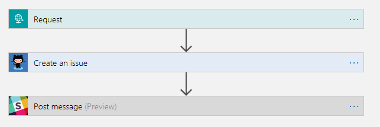
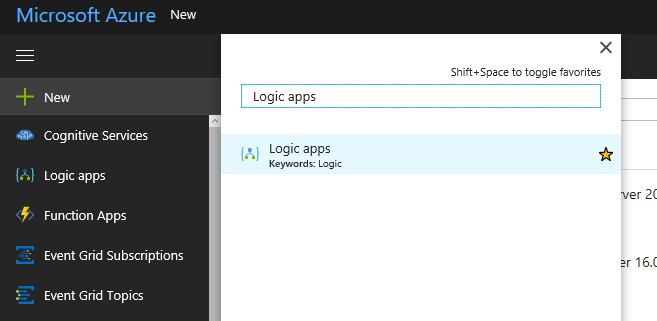
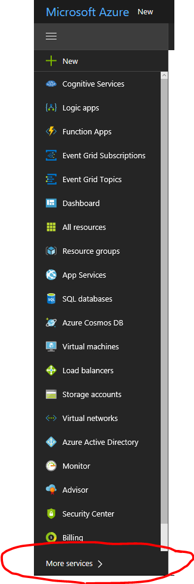
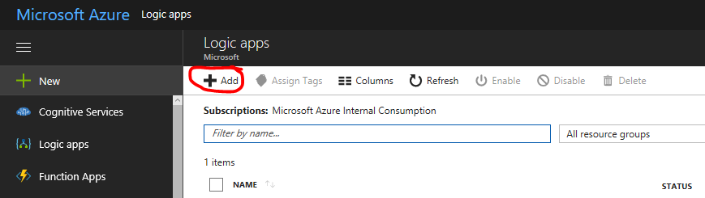
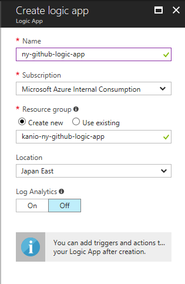
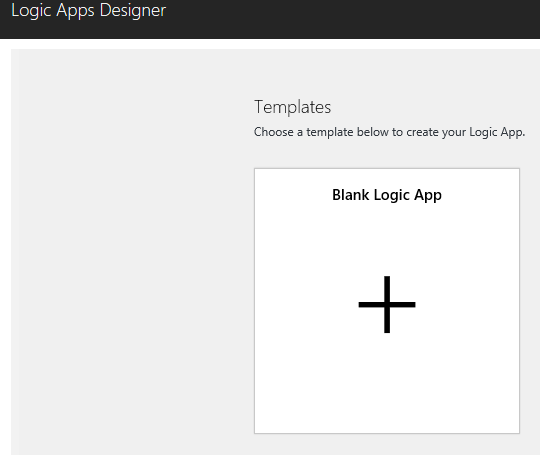

# GitHub Issue Bot 

In this part of the workshop you will extend our bot with the capability to create issue in GitHub. 
We will build logic app with 3 steps. We will use Request / Response Step Connector for invoking the Logic App. Then we will pass the HTTP payload to GitHub Connector and create an issue. 
The last and final step will be to post issue’s link to the Slack channel. Please refer to the diagram below showing the steps in logic app.

## Features

This project  provides the following features:

* Create GitHub Issue 
* Post link to the issue back to Slack

## Getting Started

### Prerequisites

1.	You need to have GitHub account, if you don’t please create one here https://github.com

2.	Access to Slack account, please verify it here – https://slack.com

3.	Access to Azure Subscription, please check here https://portal.azure.com

### Walkthrough 

- Login to Azure Portal and Create new Logic App

  - If you don’t see it on your left menu you can search for it via More Services on the bottom
  
  
  
  - Then type Logic Apps in the Search Bar 
  
  
  
  - Press Add button
  
  
  
  - And fill the required data and press the create button at the bottom
  
  
  
- Next, we will configure the Logic App. In the Logic Apps Designer please select “Blank Logic App” from the Templates section
  
  
  

