# Build a Serverless app in 30 minutes with Azure Functions and Logic Apps

## Overview

In this lab we will build a social dashboard as a Serverless app.  It will contain an Azure Logic App to trigger on all tweets coming from Twitter, process them through Cognitive Services Text Analytics (Machine Learning), call an Azure Function to categorize them, and publish them to a Power BI dashboard.  

## Getting Started

1. Log into the machine for the lab TECH-CAD-ILL200
1. You may want to increase the resolution to 1280x1024 for easier navigation
1. Use the Azure Pass code to provision an Azure Environment.
    * Go to [The Azure Pass site](https://microsoftazurepass.com)
    * Login with a Microsoft Account or Organization ID
    * Paste in the code from the right
1. Go to [the Azure Portal](https://portal.azure.com)

You should now be at the Azure Dashboard.  Here we can create a Logic App that will trigger from the tweets in real-time.

1. Click on the **New** button in the top left of the screen
1. Choose **Enterprise Integration** and select a **Logic App**  
    
1. Give it the name **Twitter-Analysis**, create a new Resource Group called **Serverless**, and put it in **West US** (you can really put anything you want in any of these fields).  Choose **Pin to dashaboard** for easy access in the remainder of the lab, and **Create** the logic app.  
    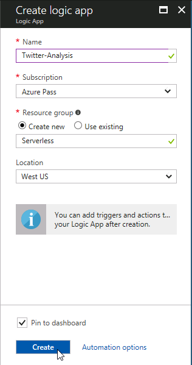

Once it's created, it *should* automatically open (if not, just open it when it's done).  If you aren't in the designer after opening, click the **Edit** button at the top menu to open the Logic App designer.

Logic Apps is the Serverless orchestration and workflow component.  It will trigger and flow data to the different aspects of the Serverless app.  We will build a logic app to trigger on Twitter, push the data to Cognitive Services, process with a Function, and publish to a Power BI dashboard.

1. Scroll down to select the **Blank Logic App** template.
1. Select the **Twitter** connector and choose the trigger **When a tweet is posted**  
    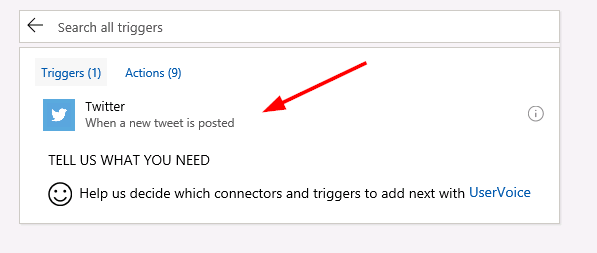
1. Authenticate with a Twitter account - you can use this one as well:
    * Username: logicappdemo
    * Password: S3rverless
1. Enter the search term **#Azure**, and set the trigger to check Twitter every **15 seconds**  
    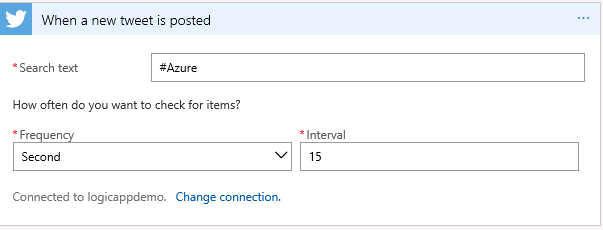
1. Click **Save** and push the **Run** button.  

You'll notice it will keep listening to Twitter until someone tweets about #Azure, and then fire.  Once you verify your trigger is working, click the **Designer** button to go back and edit

### Adding in Cognitive Services

Now we will add in a step to process all tweets with Azure Cognitive Services.

1. Back in the **Designer**, click the **New Step** and **Add an action**
1. Choose the **Text Analytics** connector and the **Detect Sentiment** action -- this will use Machine Learning to detect the sentiment of the tweet, and give a score between 0 and 1.  0 being very negative, 1 being very positive.  
    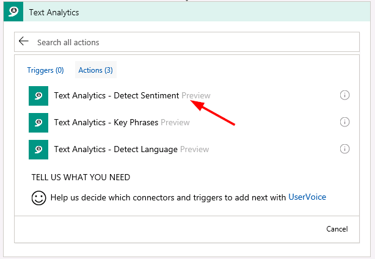
1. Provide a key to Cognitive Services.  You can use the below:
    * Connection Name: Cognitive Services
    * Account Key (use **ONE** of the following, not the whole thing):  
        * OPTION 1: `f7d3a59e6b4b4c00868723571cfb49fa`  
        * OPTION 2: `208ec8954b0044a28a66d999fb06e417`  
        * OPTION 3: `d5729bd65dc049828a235bfe67410600`  
        * OPTION 4: `680984e2b6c547c6bb107cedb785e594`  
        * OPTION 5: `c35dccf9f64b476698e24571d80369c0`
        * OPTION 6: `174cc43a72ae4558b7960a9208b6f70c`
        * OPTION 7: `1472b3fa1ac44748ab276f730515f480`  
1. Select the **Tweet Text** from the trigger to process  
    
1. Click **Save** and push the **Run** button to verify the trigger works, and the tweet is evaluated by Cognitive Services.  
    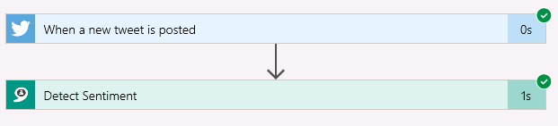

### Adding an Azure Function

Now that we have tweets with some sentiment, let's add in an Azure Function to add a category for the Tweet.  Let's create the following rules:
* Score < .3 : "Red"
* Score >= .3 and < .6 : "Yellow"
* SCore >= .6 : "Green"

For this kind of custom logic, we will create an Azure Function and add this code.

1. Save your logic app, and click the **New** button on the top-left of the Azure Portal.
1. Select the **Compute** category and choose to create a **Function App**  
    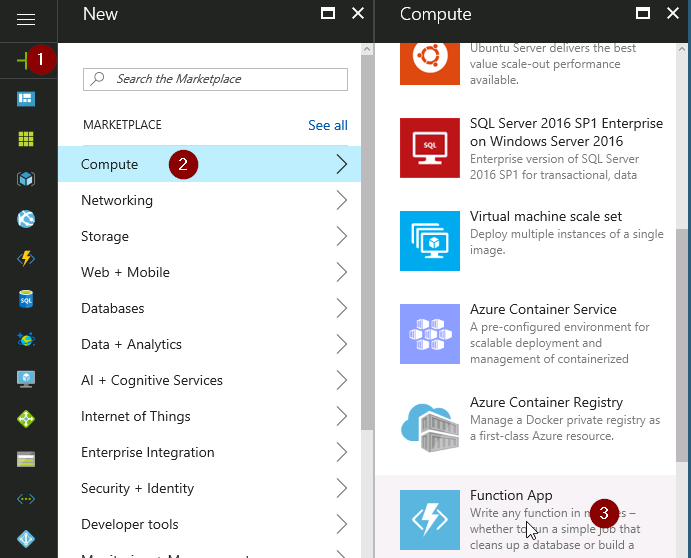  
1. Give it a **UNIQUE** name (like `ServerlessLab19592`), use the **Use existing** resource group from the Logic App (`Serverless`), keep the **Consumption Plan**, put it in **West US**, keep the **Create New** for storage, **Pin the Dashboard**, and **Create**  
    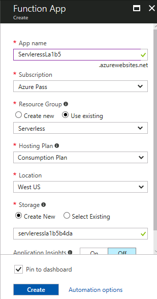  
1. Once the Function App is created (*HINT: You can skip down to the Power BI step to start setting up your dashboard while you wait*), open it up.
1. Click the **+** next to **Functions** to create a new one, and leave the settings as a C# Webhook Function.  Click **Create this function**  
    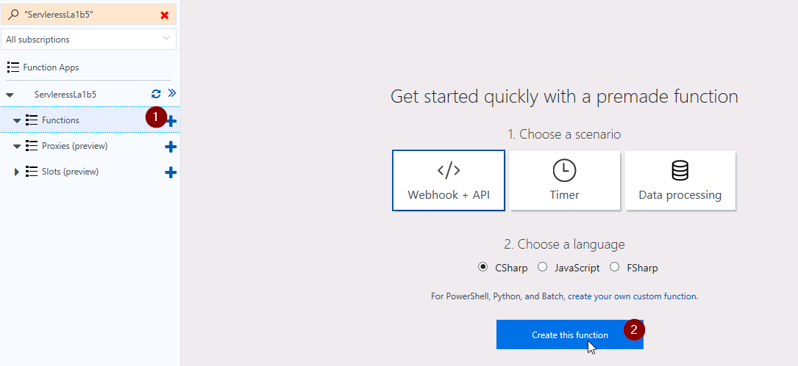

An Azure Function will not be created.  You can click **Run** just to see that it works.  The code here will fire on an HTTP Request - and we will eventually call from our Logic App.

1. Replace the code in the Azure Function with the following:  

``` csharp
using System.Net;
 
public static async Task<HttpResponseMessage> Run(HttpRequestMessage req, TraceWriter log)
{
    log.Info("C# HTTP trigger function processed a request.");
 
    // Get the score
    double score = await req.Content.ReadAsAsync<double>();
 
    // Set the category
    string category = "RED";
    if(score >= .6) {
        category = "GREEN";
    } else if (score >= .3) {
        category = "YELLOW";
    }
 
    // Return the category
    return req.CreateResponse(HttpStatusCode.OK, category);
}
```  

1. (*optional*) You can test the function by setting the **Request Body** to some score like `.7`  
      

Now that the Azure Function is created, we can go back into the Logic App to call it from there.

1. Close the Azure Function and open the Logic App from the dashboard
    (If it's not on the dashboard, you can use the search at the top, or choose the Logic App on the browse menu on the left)
1. Click the **Edit** button to return to editing your app  
    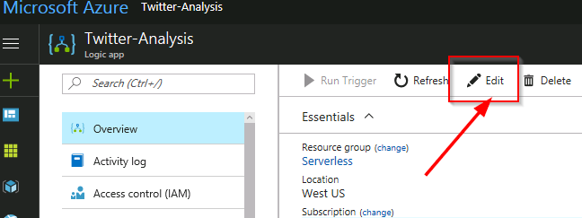  
1. Add a **New step**, **Add an Action**, and choose **Azure Functions**
1. Choose the Azure Function you just created  
    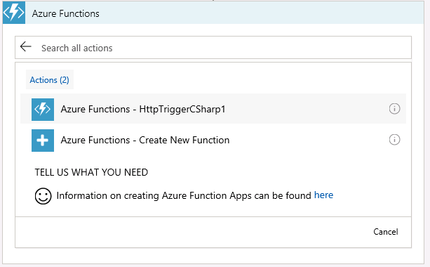  
1. Pass in the Score from the cognitive service into the Function  
    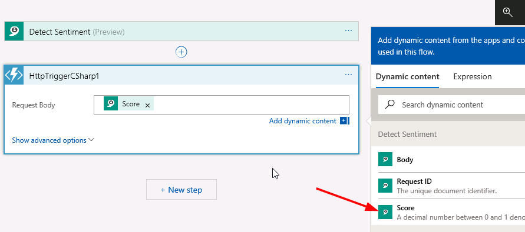  

You now have a Serverless app that can categorize tweets from Twitter in real-time.  As a last step, let's publish this to a Power BI dashboard.

## Publish to a Power BI dashboard

### Using the pre-built dashboard

Using a pre-built dashboard will allow you to finish the lab quicker, but if you want details on using a dashboard you create from scratch in Power BI you can see details [here](#Creating_a_dashboard_in_Power_BI_142)

1. Add a new step and search for **Power BI** - choose **Add rows to a dataset**
1. Login with the following pre-created dashboard:
    * username: user@builddemo.com
    * password: S3rverless
1. Select **My Workspace**, the **Twitter** dataset, and the **RealTimeData** table.
1. Fill in the following items (remember the Category is coming from our Azure Function):  
> NOTE: You will need to use the Search box on the outputs to fine the **Created At** - or click **Show More** as it is an advanced output  
    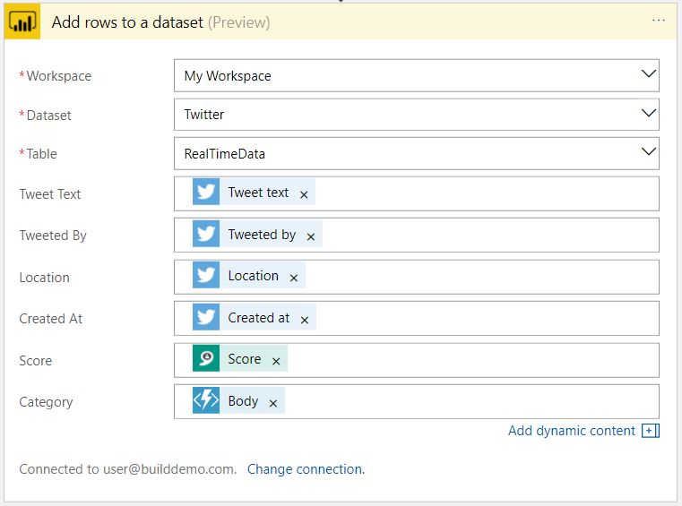  
1. Click save, and run.  

That's it! You can now to go PowerBI.com and login with `user@builddemo.com` account with password `S3rverless` to see the tweets appear in real-time.

## Next Steps

You have a few options if you have finished this far.  You can learn how to create a dashboard from scratch [here](#Creating_a_dashboard_in_Power_BI_142), or you can open your logic app to add logic like "If the score is less than .3, send an email to me."  To do that you would add a "Condition", and then add an action in the "If yes" branch.

### Creating a dashboard in Power BI

1. Go to [https://app.powerbi.com] to login to Power BI.
1. You may be able to use the Azure account here, or you may need to use the provided O365 account.
1. Skip through the sign-up steps to get to the Power BI dashboard.
1. Once at the **Get Data** screen - select the **My Workspace** button, and click the **Skip for now** option.  **You need to click the "My Workspace" area for 'skip for now' to appear**  
    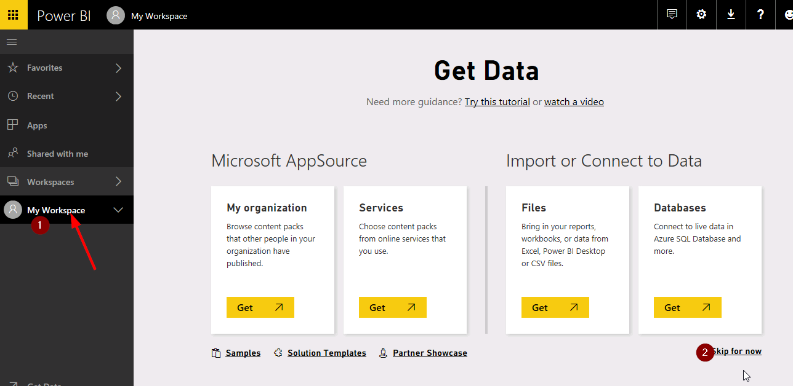  
1. Select **Datasets**, **+ Create**, and **Streaming Dataset** to create a dataset to stream data to.
1. Click **Next** for "API"
1. Provide the following information:  

* Dataset name: Twitter
* Values for the dataset:  

|Value|Type|
|--|--|
|Tweet Text|Text|
|Created At|DateTime|
|Score|Number|
|Location|Text|
|Category|Text|  

* Historic data analysis: ON  
    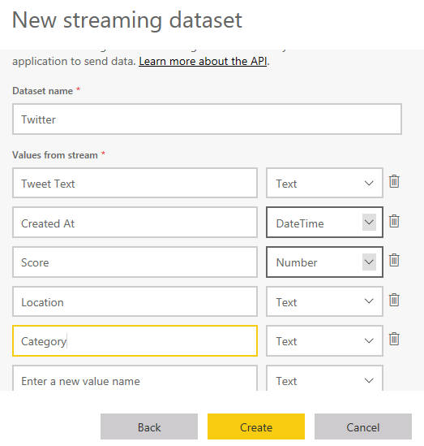  

    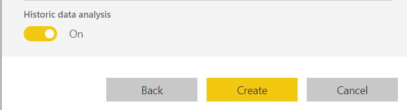  

### Creating the report

Once the dataset is created, you need to create a report to visualize the data.

1. Select your workspace **Datasets**, and click the **Create report** icon for the Twitter dataset.  
    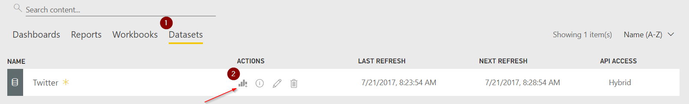  
1. Select the **Line chart** visualization, and chart it with **Created At** as the axis, and **Score** as the values.  Change score to the average.  This will draw a real-time line chart of average sentiment score over time.  
    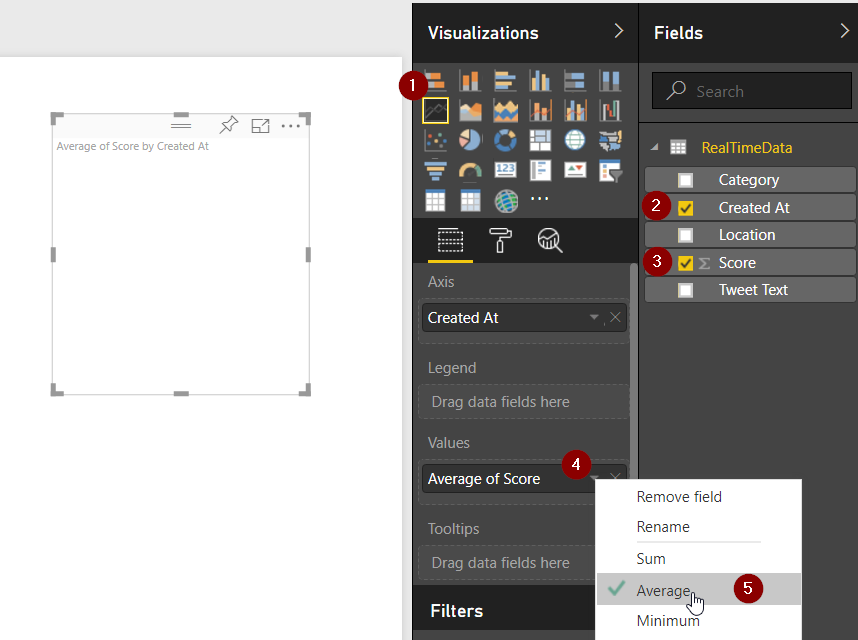  
1. Pin your visualizations to a dashboard by clicking the **Pin** button.  
    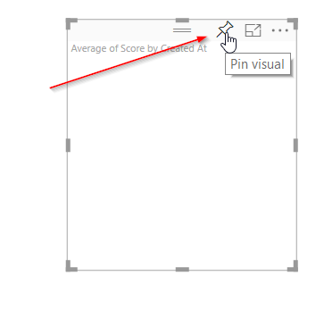  
1. Choose to save your report (could name it **Twitter**), and create a new dashboard.  
    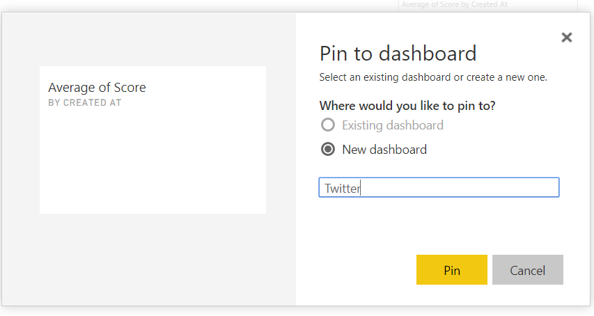  
1. You can continue to add more visualizations using similar steps - like a Map with location being **Location**, and size being **Score**
1. You can now go back to the ["pre-built dashboard" section](#Using_the_prebuilt_dashboard_122), but instead of using the shared dashboard credentials, login with your O365 credentials.  This will then publish your data to this dashboard.

## Conclusion

Hopefully you were successful and understand the power and speed in which you can ship cloud-scale applications with serverless.  If you have any questions or need any help feel free to contact me at `jehollan@microsoft.com`